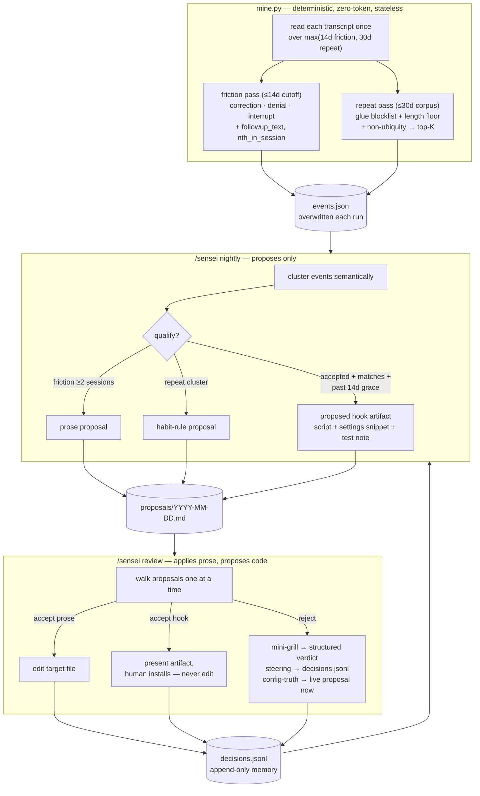
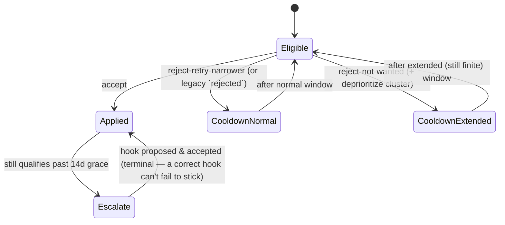

# feat: Implement ideas-triage ADRs 0010–0013

## Summary

Four `proposed` ADRs from the 2026-07-18 ideas triage turn sensei from *"learn from my
pain"* into *"learn from my habits"* and give it a memory that reasons about its own past
verdicts. This plan implements them, plus issue #13's event enrichment, across the two
existing surfaces — the deterministic miner (`mine.py`, stdlib-unittest-covered) and the
prose skill (`skill/SKILL.md`, nightly + review modes) — with the `launchd` window and the
project docs kept consistent.

The work splits into two tracks that share one seam (`decisions.jsonl`):

- **Miner track** — richer events (#13), a wider stateless read window (ADR-0010), and a new
  `repeat` event type with structural thinning (ADR-0011) plus the nightly consumer that turns
  repeats into habit-rule proposals.
- **Skill / memory track** — structured rejection verdicts with a mini-grill (ADR-0013), and
  loop-closing escalation of non-sticking rules to a *proposed* hook (ADR-0012).

Every invariant from ADR-0001–0009 holds: the miner stays deterministic, zero-token, and the
only reader of raw transcripts; nightly proposes and never applies; Python stays stdlib-only;
macOS-only; no cross-run miner state.

---

## Problem Frame

sensei today only learns from *rare* friction inside a *1-day* window, and treats every
rejection as an information-free 30-day timer. Four structural limits follow:

1. **Slow-burn friction is invisible.** A pattern firing once Tuesday and once Thursday never
   reaches the ≥2-independent-sessions bar inside `--days 1`, so the most valuable friction —
   the kind the user stopped consciously noticing — never surfaces (ADR-0010).
2. **Habits are unmined.** A directive the user re-supplies every session with *no friction*
   ("use ddev", "branch off develop") is never captured, yet it is exactly the rule sensei
   should propose (ADR-0011, issue #9).
3. **"Accepted" is treated as done forever.** A rule sensei installed that keeps failing is
   never escalated; prose is the only lever and there is no rung above it (ADR-0012, issue #10).
4. **Rejections teach nothing.** A bare `rejected` verdict discards the reason — including
   reasons that are *a better rule trying to get out* (ADR-0013, issue #12).

Issue #13 adds the lowest-risk enabler: interrupt events lose the user's follow-up correction,
and per-session caps can hide genuine repeats because events carry no ordinal.

**Success criteria.** The miner emits enriched events and a `repeat` type over a wide,
stateless window, with existing tests updated and new tests green. Nightly consumes repeats,
escalates non-sticking rules to a proposed hook, and applies a two-tier cooldown keyed on a
structured verdict. Review runs a mini-grill on reject and routes the reason. All four ADRs
flip `proposed → accepted`. No new dependencies, no new persistent miner state, no macOS
portability shims.

---

## Requirements

Traceability back to the origin ADRs and issues. `R#` are plan-local requirement IDs.

| ID | Requirement | Origin |
|----|-------------|--------|
| R1 | Interrupt events carry `followup_text`: the next plain user text message after the interrupt (skip tool_result / slash-command / interrupt records; tolerate none). | #13 sub-idea 1 |
| R2 | Correction and interrupt events carry a raw deterministic `nth_in_session` ordinal so the LLM can judge recurrence; the miner never decides sameness itself. | #13 sub-idea 2 |
| R3 | The friction read window widens from `--days 1` to ~14 days; the miner remains stateless and overwrites `events.json` each run (no cross-run ledger). | ADR-0010 |
| R4 | A fourth event type `repeat` captures re-supplied directives with no friction, thinned **structurally** (glue blocklist, length floor, non-ubiquity/inverse-frequency), never lexically; output hard-capped top-K and deduped. | ADR-0011, #9 |
| R5 | The repeat pass counts recurrence across ~30 days (wider than the friction window), stateless recompute. | ADR-0010, ADR-0011 |
| R6 | Nightly consumes `repeat` events and proposes a habit-rule from a qualifying repeat cluster; the repeat qualifying bar is defined explicitly (a repeat is already cross-session by construction). | ADR-0011 (consumption) |
| R7 | The `repeat` type is reconciled in project docs — `Event` definition and a `Repeat` glossary entry in CONTEXT.md, the ADR-0004 invariant line in CLAUDE.md (bounded exception), and user-facing description in README/SKILL.md. | ADR-0011 framing |
| R8 | Review runs a mini-grill on reject and records a **structured verdict** (`reject-retry-narrower` \| `reject-not-wanted`) that drives a two-tier finite cooldown; legacy bare `rejected` lines keep the flat 30-day cooldown. | ADR-0013, #12 |
| R9 | The rejection reason has a dual exit: a *steering* reason is stored in `decisions.jsonl`; a *config-truth* reason is promoted into a live CLAUDE.md/skill proposal during review. | ADR-0013 |
| R10 | Nightly escalates a pattern that already qualifies, semantically matches an **accepted** decision, and is dated past a ~14-day grace period — flipping step 2 from "accepted → skip" to "accepted-but-still-qualifying-after-grace → escalate." | ADR-0012, #10 |
| R11 | The escalation target is a **hook** and sensei only ever **proposes** it: a ready artifact (hook script + exact `settings.json` snippet + placement advice from the event `project` field + a test note), then stops. Never written, never offered. Permissions are out of scope. | ADR-0012 |
| R12 | Hook governance is soft: narrowest matcher, read existing hooks and prefer extending one, surface the current count; no hard ceiling. | ADR-0012 |
| R13 | All four ADRs flip `status: proposed → accepted` with issue references, matching ADR-0003's convention. | housekeeping |

---

## Key Technical Decisions

**KTD-1 — One wide read, two internal cutoffs (not two miner runs, not a ledger).** `mine.py`
reads each transcript once over the *widest* window it needs (~30 days), then applies two
cutoffs: friction events are filtered to the ~14-day window; the repeat computation uses the
full ~30-day corpus. The plist keeps a friction-window semantic (`--days 14`); the repeat
window is a module constant (`REPEAT_WINDOW_DAYS = 30`), and the loop's actual file cutoff is
`max(friction_window, REPEAT_WINDOW_DAYS)`. Rationale: single pass, matches ADR-0010's
"recompute beats reconcile," keeps the plist readable. **Consequence to note in the plan and
tests:** `sessions_scanned` / `in_window` semantics shift — a session whose only events are
20 days old is scanned for repeats but contributes zero friction. (Alternative rejected: a
`--repeat-days` flag — more surface, and the plist would then carry two windows.)

**KTD-2 — `repeat` thinning is structural, never lexical (bounded ADR-0004 exception).** A
small glue blocklist (~20 acknowledgment tokens: yes/ok/next/continue/…), a length floor, and
a **non-ubiquity** test (a phrase recurs across ≥N sessions but is *not* present in nearly all
of them — inverse-frequency, TF-IDF-ish, stdlib-trivial). No directive allowlist, ever. This is
the *only* place the deterministic stage does more than crude over-capture; it is scoped
precisely to `repeat` — friction detection stays greedy. Documented as the bounded exception in
ADR-0011 and the CLAUDE.md invariant line.

**KTD-3 — `followup_text` needs a look-ahead the current loop lacks.** Today the interrupt
event is emitted immediately (`mine.py:122`). To attach the *next* plain user text, keep a
pointer to the last-emitted interrupt event awaiting a follow-up; on the next qualifying plain
user text record (skip tool_result / `<...>` / slash-command / another interrupt), backfill its
`followup_text` and clear the pointer. Tolerate "no follow-up" (session ended). Purely
deterministic — no semantics.

**KTD-4 — `decisions.jsonl` is the shared seam; evolve it additively with legacy compat.**
The verdict field gains values (`reject-retry-narrower`, `reject-not-wanted`) alongside the
existing `accepted`; a steering-reason field is added. Nightly step 2 reads the new values for
the two-tier cooldown and reads `accepted` dates for grace-period escalation. **Legacy lines**
(bare `rejected`, or pre-`key` lines) must keep working: a bare `rejected` maps to the flat
30-day cooldown; a missing `key` falls back to semantic title match (as today). U5 settles the
schema before U6 consumes it.

**KTD-5 — The prose/code boundary (refines ADR-0002).** Review *applies* prose edits but only
*proposes* code. A hook is executable code in structured JSON where a malformed edit breaks all
config loading — categorically unlike appending a sentence. So a hook escalation produces a
complete ready artifact and **stops**; the human installs it. This is a review-mode behavior
change: on a hook proposal, review presents it, records the decision, and does **not** edit any
file — distinct from prose proposals, which it applies.

**KTD-6 — Repeat qualifying bar differs from friction.** Friction qualifies at ≥2 independent
sessions *or* one high-severity event. A `repeat` is *already* cross-session by construction
(the miner's non-ubiquity test requires ≥N sessions). So nightly qualifies a repeat cluster on
the miner having emitted it plus a semantic root-cause cluster — it does not re-apply the
friction ≥2-sessions gate on top. Stated explicitly so nightly does not silently drop every
repeat for "not being friction."

---

## High-Level Technical Design

**Data flow after this plan (one nightly cycle):**

**Cooldown state machine (ADR-0013 two-tier, amends ADR-0003):**

Both mermaid diagrams render authoritative content; the prose is the tiebreaker where they disagree.

---

## Implementation Units

Build order: miner track (U1 → U2 → U3 → U4), then skill/memory track (U5 → U6), housekeeping
last (U7). Tracks are largely independent; U6 is sequenced after U5 because both edit nightly
step 2 and the `decisions.jsonl` schema.

### U1. Miner: enrich interrupt and correction events (#13)

- **Goal** — Attach `followup_text` to interrupt events and a raw `nth_in_session` ordinal to
  correction/interrupt events, so downstream clustering can see corrections that recur and
  interrupts that were immediately clarified.
- **Requirements** — R1, R2.
- **Dependencies** — none. Lowest-risk item; natural first build (per #13).
- **Files** — `mine.py`, `tests/test_mine.py`, `tests/fixtures/projects/**` (add a fixture
  session exercising interrupt→follow-up and a within-session repeat).
- **Approach** — Per KTD-3, add a "pending interrupt awaiting follow-up" pointer in
  `mine_session`; backfill `followup_text` on the next qualifying plain user text record.
  `nth_in_session` is a per-session, per-type 1-based counter incremented as events are emitted.
  No semantics — the miner never judges whether two corrections are "the same" (that stays the
  LLM's job, reaffirming ADR-0004).
- **Test scenarios** —
  - Interrupt followed by a plain user text → event has `followup_text` = that text.
  - Interrupt followed by a tool_result then a plain user text → `followup_text` skips the
    tool_result and picks the plain text.
  - Interrupt with no following user message (session ends) → `followup_text` absent/empty, no crash.
  - Two corrections in one session → ordinals 1 and 2 in `nth_in_session`.
  - Existing all-time fixture still yields the same three event *types*; assertions updated to
    tolerate the new fields (see U-wide note on existing tests).
- **Verification** — `python3 -m unittest discover tests` green; a manual
  `python3 mine.py --days 0 --projects-dir tests/fixtures/projects --out <scratch>` shows the new
  fields on the right events.

### U2. Miner: widen the friction read window to ~14 days (ADR-0010)

- **Goal** — Surface slow-burn friction by widening the friction window from 1 to ~14 days,
  while the miner stays stateless and keeps overwriting `events.json`.
- **Requirements** — R3.
- **Dependencies** — none (independent of U1).
- **Files** — `mine.py` (window handling), `sh.sensei.plist.template` (`--days 1` → `--days 14`),
  `tests/test_mine.py`.
- **Approach** — Change the plist friction window to 14. In `mine.py`, keep `--days` as the
  friction window but prepare the single-wide-read structure from KTD-1 (the actual file cutoff
  becomes `max(--days, REPEAT_WINDOW_DAYS)` once U3 lands; until then it is just `--days`). Do
  **not** add any cross-run state — reaffirm the stateless recompute in a code comment referencing
  ADR-0010. The agent-facing caps (`MAX_TOTAL`, `MAX_PER_SESSION`, dedup) are unchanged: a wider
  read window must not enlarge the LLM's context.
- **Execution note** — Verify against fixtures with explicit `--days` values rather than wall-clock,
  so tests are deterministic (fixtures use fixed 2020 timestamps).
- **Test scenarios** —
  - `--days 14` includes an event dated 10 days ago and excludes one dated 20 days ago.
  - `--days 0` (all time) unchanged from today's behavior.
  - `MAX_TOTAL` still caps output regardless of window width.
- **Verification** — unittest green; the plist template shows `--days 14`.

### U3. Miner: `repeat` event type with structural thinning (ADR-0011)

- **Goal** — Emit a fourth event type `repeat` for re-supplied directives with no friction,
  thinned structurally, counted across ~30 days, hard-capped top-K and deduped.
- **Requirements** — R4, R5, R7 (miner-adjacent docs).
- **Dependencies** — U2 (window infrastructure).
- **Files** — `mine.py`, `tests/test_mine.py`, `tests/fixtures/projects/**`, `CONTEXT.md`
  (amend `Event` definition, add `Repeat` glossary entry), `CLAUDE.md` (ADR-0004 invariant line:
  note the bounded exception → ADR-0011).
- **Approach** — Per KTD-1/KTD-2: read over the 30-day corpus; collect candidate user-text
  phrases (normalized), drop glue-blocklist tokens and sub-floor lengths, then keep phrases that
  recur across ≥N sessions but are *not* near-ubiquitous (inverse-frequency). Emit surviving
  phrases as `repeat` events carrying their cross-session count; apply a top-K cap and dedup like
  every other signal. No directive allowlist. Keep the glue blocklist small and language-agnostic.
- **Technical design (directional)** — non-ubiquity ≈ keep phrase `p` when
  `sessions_with(p) ≥ N` and `sessions_with(p) / sessions_total < UBIQUITY_CEILING`. Constants
  (`N`, `UBIQUITY_CEILING`, `REPEAT_WINDOW_DAYS`, length floor, glue set) live at module top with
  the other caps. Directional only — the implementer tunes thresholds against the real corpus.
- **Test scenarios** —
  - A directive phrase repeated across 3 sessions → one `repeat` event with count 3.
  - A glue token ("continue") repeated across many sessions → **not** emitted (blocklist).
  - A short phrase below the length floor → not emitted.
  - A phrase present in *nearly all* sessions → not emitted (ubiquity ceiling).
  - Repeat output respects the top-K cap.
  - **Existing fixture assertions updated:** the all-time fixture test's `len(events) == 3` and
    per-type counts must be revised to account for any `repeat` events the fixtures now produce
    (or fixtures kept repeat-free by design and the test asserting zero repeats). Flag this as an
    *update*, not a new test — do not mistake the red for a regression.
- **Verification** — unittest green; CONTEXT.md and CLAUDE.md no longer describe events as
  friction-only.

### U4. Nightly: turn repeats into habit-rule proposals (ADR-0011 consumption)

- **Goal** — Make the emitted `repeat` events do work: nightly clusters them and proposes a
  habit-rule (a re-supplied directive → a CLAUDE.md/skill rule).
- **Requirements** — R6, R7 (user-facing docs).
- **Dependencies** — U3 (repeats must exist to consume).
- **Files** — `skill/SKILL.md` (nightly steps 3–4), `README.md`, `CONTEXT.md` (if the `Pattern`/
  `Proposal` language needs a habit-rule note).
- **Approach** — Extend nightly step 3 so clustering is over *friction and repeats*, not friction
  only. Add the repeat qualifying bar from KTD-6 (a repeat is already cross-session; do not
  re-impose the friction ≥2-sessions gate). Step 4 drafts a rule proposal from a qualifying repeat
  cluster using the same proposal shape (title, key, evidence quotes tagged by project, root
  cause, target file, exact text). Update the SKILL.md `description` and README so the tool is
  described as learning from habits, not only friction.
- **Execution note** — Prose/instruction change; no unit test. Verify with a fixture-driven
  headless dry-run, not automated assertions.
- **Test scenarios** — `Test expectation: none — SKILL.md is LLM instructions, not code.`
  Verification is a manual dry run (below).
- **Verification** — Run the miner against a fixture corpus containing a repeated directive,
  point `events.json` at it, run `/sensei nightly` by hand, and confirm the report contains a
  well-formed habit-rule proposal with a stable `key` and project-tagged evidence.

### U5. Rejection carries a structured verdict + mini-grill (ADR-0013)

- **Goal** — Replace the bare 30-day rejection timer with a mini-grill that captures the reason,
  a structured verdict that drives a two-tier finite cooldown, and dual routing of the reason.
- **Requirements** — R8, R9.
- **Dependencies** — none in the miner track; settles the `decisions.jsonl` schema before U6.
- **Files** — `skill/SKILL.md` (review step 2–3 and nightly step 2), `CONTEXT.md` (amend
  `Decision` / `Cooldown` language to two-tier).
- **Approach** — Review, on reject, runs a short mini-grill ("why?") — making "I don't want this
  at all" the *expensive* path. Classify the outcome into a structured verdict:
  `reject-retry-narrower` (normal cooldown; steer a narrower re-proposal) or `reject-not-wanted`
  (extended-but-finite cooldown + deprioritize the cluster). Dual exit: a *steering* reason is
  written into the `decisions.jsonl` line; a *config-truth* reason is promoted into a live
  CLAUDE.md/skill proposal right there in review (review is allowed to apply prose). Extend the
  `decisions.jsonl` line schema (new verdict values + a `reason`/`reason_kind` field). Update
  nightly step 2 to read the two-tier cooldown. **Legacy compat (KTD-4):** a bare `rejected` line
  keeps the flat 30-day cooldown; missing `key` falls back to semantic title match.
- **Execution note** — Amends ADR-0003; keep the "cooldown is finite, never permanent" invariant
  explicit in the SKILL.md text.
- **Test scenarios** — `Test expectation: none — SKILL.md is LLM instructions, not code.`
- **Verification** — Dry-run review against a proposal: reject with a config-truth reason →
  confirm review drafts a live prose proposal and writes a structured verdict line; reject with a
  steering reason → confirm the reason lands in `decisions.jsonl` and no live proposal is drafted.
  A synthetic legacy `rejected` line still suppresses for exactly 30 days.

### U6. Close the loop: escalate a non-sticking rule to a *proposed* hook (ADR-0012)

- **Goal** — Escalate a rule that keeps failing after acceptance to a *proposed* hook artifact —
  nightly generates it, review presents it, sensei never writes or offers to write it.
- **Requirements** — R10, R11, R12.
- **Dependencies** — U2 (the wide window supplies aged qualifying events); U5 (shared
  `decisions.jsonl` schema and nightly step-2 edits — sequence after).
- **Files** — `skill/SKILL.md` (nightly step 2 + a new escalation branch in step 4; review step
  2–3 hook-proposal handling), `CONTEXT.md` (if a `Hook proposal` term is worth glossing).
- **Approach** — Flip nightly step 2 from "accepted rule already covers this → skip" to "accepted
  **but still qualifying after ~14-day grace** → escalate." The trigger is a proxy (does the
  pattern independently re-clear the qualifying bar weeks after acceptance), reusing existing
  thresholds and the acceptance `date` — zero new state. On escalation, step 4 emits a ready hook
  artifact: the hook script + the exact `settings.json` snippet + placement advice inferred from
  the event `project` field + a test note — then stops. Governance (KTD-5/R12): propose the
  narrowest matcher, read existing hooks and prefer extending one over a new entry, surface the
  current hook count; no hard ceiling. Review handling (KTD-5): a hook proposal is *presented*,
  the decision is recorded, but **no file is edited** — the human installs it. Reject → cooldown.
- **Execution note** — This is the ADR-0002 refinement (applies prose, proposes code); make the
  "never write, never offer" boundary explicit and absolute in the SKILL.md text.
- **Test scenarios** — `Test expectation: none — SKILL.md is LLM instructions, not code.`
- **Verification** — Construct a synthetic `decisions.jsonl` with an `accepted` line dated >14
  days ago plus fresh `events.json` still matching it; run `/sensei nightly` by hand and confirm
  the report contains a complete hook artifact (script + settings snippet + placement + test note)
  and that review presents it without editing any file.

### U7. Flip ADR statuses `proposed → accepted` (housekeeping)

- **Goal** — Record that the four decisions are now implemented, matching ADR-0003's convention.
- **Requirements** — R13.
- **Dependencies** — U1–U6 landed (or landing in the same PR series).
- **Files** — `docs/adr/0010-…md`, `docs/adr/0011-…md`, `docs/adr/0012-…md`, `docs/adr/0013-…md`.
- **Approach** — Change each frontmatter `status: proposed — from ideas triage (issue …)` to
  `status: accepted — implemented (issue …)`, mirroring ADR-0003's `status: accepted —
  implemented (issue #1)`. No body changes.
- **Test scenarios** — `Test expectation: none — metadata edit.`
- **Verification** — `grep -l 'status: proposed' docs/adr/00{10,11,12,13}-*.md` returns nothing.

---

## Cross-Cutting Note: Existing Tests Break — Update, Don't Regress

`tests/test_mine.py` asserts exact event counts (`len(events) == 3`) and per-type counts against
the current two fixtures. U1 (new event fields) and U3 (a new `repeat` type) will make these
assertions fail. **This is expected**, not a regression: the implementer must *update* the
existing assertions and fixtures in the same unit that changes miner output, and must not chase
the red as if it were a new bug. Every miner unit's "Files" list includes `tests/test_mine.py`
for this reason.

---

## Scope Boundaries

**In scope** — all of R1–R13 above.

### Deferred / out of scope (already decided against)

- **Persistent observations ledger** — rejected by ADR-0010 in favor of the wide window. Reopen
  only if valuable friction recurs on a horizon longer than ~30 days.
- **Permission-rule targets** (`deny`/`allow` in `settings.json`) — rejected by ADR-0012;
  worthless under auto-accept / `--dangerously-skip-permissions`. Hooks are the only escalation
  target.
- **Rate-decline comparison** for loop-closing — rejected by ADR-0012 as premature (needs stored
  pre-acceptance rate = new state). The re-qualify proxy ships first; add rate-tracking only if
  the proxy proves twitchy.
- **A directive allowlist** for repeats — rejected by ADR-0011; structural thinning only.
- **Cross-platform / Linux / Windows shims** — out by ADR-0007 (macOS-only).
- **New Python dependencies or a venv** — out by ADR-0008 (stdlib-only).

---

## Risks & Dependencies

- **`decisions.jsonl` schema drift (U5↔U6).** Both units edit nightly step 2 and the decision
  line. Mitigation: U5 settles the schema and legacy-compat rules first; U6 consumes them. If
  built in parallel, coordinate the line format explicitly.
- **Fixture churn.** The miner units all touch fixtures + assertions. Mitigation: the
  cross-cutting note above; land fixture edits inside the causing unit.
- **Repeat thinning tuned on fixtures, not the real corpus.** Thresholds (`N`,
  `UBIQUITY_CEILING`, length floor) are directional. Mitigation: the ADR keeps precision the
  LLM's job; over-capture stays acceptable, so mistuning fails safe toward recall.
- **Manual verification for skill units (U4–U6).** SKILL.md is prose, not code — no automated
  coverage. Mitigation: each unit specifies a fixture-driven headless dry run; per CLAUDE.md,
  never let a dry run overwrite live `~/.claude/sensei/events.json` (use `--out <scratch>`).
- **Grace-period over-escalation (U6).** The proxy's worst case is a rejectable over-escalation,
  not a broken system (ADR-0012) — acceptable by design; reject → cooldown.

---

## Sources & Research

- `docs/adr/0010–0013` — the four decisions implemented here (origin).
- `docs/adr/0001–0009` + `CONTEXT.md` — invariants these extend (deterministic miner, propose-not-apply, cooldown, recall-over-precision, stdlib-only, macOS-only, install-by-copy).
- GitHub issues #13, #12, #9, #10 — refined designs and the stated build order.
- `mine.py`, `skill/SKILL.md`, `sh.sensei.plist.template`, `tests/test_mine.py` — the implementation surfaces.
