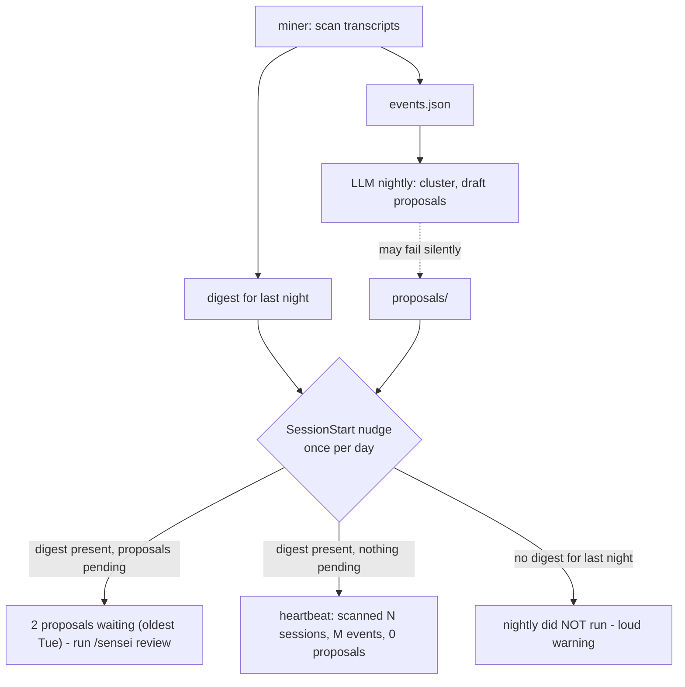

# Nightly Digest and Session Nudge - Plan

## Goal Capsule

- **Objective:** Every morning sensei proves it patrolled — a deterministic nightly digest plus a once-per-day in-session line that replaces the never-seen 05:30 notification and makes a broken run unmistakable.
- **Product authority:** This document; open product questions go to the repo owner.
- **Open blockers:** None.

---

## Product Contract

### Summary

The miner writes a dated digest artifact every night before the LLM stage runs, so a missing digest is itself the failure signal. A SessionStart hook prints one line, at most once per day, carrying the payload: heartbeat on quiet nights, pending-proposal count when there is something to review, or a loud "nightly did not run" when the digest is absent. The osascript success notification is removed, and review starts storing each accepted pattern's pre-acceptance event count so a future track-record slice has baselines from day one.

### Problem Frame

The user has never seen the 05:30 macOS notification — it fires while they are asleep and evaporates. They forget to run `/sensei review` most days, and when they do, recent mornings showed zero proposals, which today is indistinguishable from a silently failed run: the launchd chain aborts without any signal on miner failure (`sh.sensei.plist.template:31`, `&&` with no failure branch). The verification cost is real — the user has resorted to asking a separate Claude session to investigate whether the nightly ran at all. Most mornings of a well-tuned sensei are zero-proposal mornings, so the ambiguous quiet state is the product's most-seen surface. Separately, the user wants to know whether accepted rules actually reduced friction, and today nothing stores the baseline that question needs.

### Key Decisions

- **The miner owns the digest, written before the LLM stage.** Only the deterministic layer can guarantee the artifact exists every night; a digest written by the LLM stage would vanish exactly when the chain breaks. This extends the miner's role beyond `events.json` into a human-facing artifact — a deliberate redraw of the ADR-0001 boundary that planning should capture in a new ADR.
- **Missing digest is the failure signal.** No separate failure marker, no failure notification. The nudge checks for last night's digest; absence means the run failed or never started.
- **The heartbeat always prints.** Even a nothing-happened morning gets one muted line. Silence is the exact ambiguity this slice exists to remove, so no state maps to no output.
- **In-session is the sole surface.** The osascript success notification (fired from `skill/SKILL.md:76`) is removed outright, not demoted. A day the user never opens Claude Code is a day sensei says nothing — accepted, since review happens in-session anyway.
- **The receipt seed ships now without a consumer.** One integer stored at accept time. Baseline history is unrecoverable retroactively; the reporting that consumes it is a later slice.

### Requirements

**Nightly digest**

- R1. Every nightly run writes a dated digest artifact from the deterministic miner stage, before the LLM stage runs; a failed or skipped LLM stage still leaves the digest.
- R2. The digest reports at minimum: sessions scanned, and event counts by type and by project (counts are post-cap — the miner caps at 400 events total / 15 per session). **No proposals section** — the miner runs before the LLM stage and cannot know proposals; pending state is read live by the nudge (see D1).
- R3. Each night's digest is a durable record — later runs do not overwrite earlier nights' entries, so "was sensei there Tuesday?" stays answerable.

**Session nudge**

- R4. A SessionStart hook shows exactly one sensei line in the first Claude Code session of each calendar day, and nothing in subsequent sessions that day — **in the healthy state (digest present)**. The failure line (R7) is exempt: it repeats every session until the digest appears or the day turns over (see D6). The line is delivered via the hook's `hookSpecificOutput.systemMessage` field, not plain stdout, which is not user-visible (see D7).
- R5. When last night's digest exists and no proposals are pending, the line is a heartbeat summarizing the digest (sessions scanned, events, zero proposals).
- R6. When proposals are pending, the line states the count and the age of the oldest, and names `/sensei review` as the action.
- R7. When no digest exists for last night, the line states loudly that the nightly did not run and where to look for the cause.
- R8. A night with no transcript activity still produces a digest and a muted heartbeat — "quiet night" is a reported state, not silence.

**Notification removal**

- R9. The osascript success notification is removed from the nightly flow; the session nudge is the only surface announcing nightly outcomes.

**Receipt seed**

- R10. When review applies an accepted proposal, the decision record additionally stores the pattern's pre-acceptance event count. No reporting, no delta math, no grace-period logic in this slice.

### Acceptance Examples

- AE1. **Covers R5.** Given the nightly ran and found 14 events across 6 sessions with no qualifying pattern, when the user opens their first session of the day, then they see one line like "sensei: last night scanned 6 sessions, 14 events, 0 proposals" and no other sensei output that day.
- AE2. **Covers R6.** Given 2 proposals written Tuesday remain unreviewed and today is Friday, when the first session of the day starts, then the line reports 2 proposals waiting with the oldest from Tuesday and points at `/sensei review`.
- AE3. **Covers R7.** Given launchd never fired (machine asleep) or the miner crashed, when the first session of the day starts, then the line states the nightly did not run — the state that previously required asking a separate Claude session to diagnose.
- AE4. **Covers R4.** Given the user opens five sessions in one day, then only the first prints a sensei line.
- AE5. **Covers R10.** Given the user accepts a proposal whose pattern had 5 supporting events, then the appended decision record carries that count; rejecting a proposal stores no count.

### Success Criteria

- "Did sensei run last night?" is answerable by reading one line at session start — never again by manual investigation.
- The nudge never nags: one line per day, at most two lines of terminal output.

### Scope Boundaries

Deferred for later slices:

- Friction-receipt reporting ("5 events → 0. Working.") and `/sensei status` — the track-record slice, which consumes this slice's digest and stored baselines.
- Consent-agenda batch review — no proposal-volume pain yet at ~0 proposals per morning.
- The Founding Report (install-time backfill) — distribution-facing, not daily-experience.
- A "patterns brewing below threshold" digest section — sub-threshold patterns have no stable identity across runs (clustering is LLM-semantic), so the claim cannot be made reliably.
- Any notification channel outside Claude Code sessions.

### Dependencies / Assumptions

- Registering a SessionStart hook means the install surface writes into the user's Claude Code settings — the first time sensei touches config outside its own directory. Install must be idempotent and uninstall must remove the hook.
- The digest-in-miner decision needs a short ADR amending the ADR-0001 boundary (miner emits a human-facing artifact, still zero-token and deterministic).
- The miner stays stdlib-only (ADR-0008) and copy-installed (ADR-0009); the digest and nudge must not add dependencies.
- The pre-acceptance event count is **not** derivable from the proposal's 2–3 evidence quotes (they under-count the cluster). Nightly must write an explicit `Supporting events: N` field — the cluster size it already computed — on each proposal; review copies it to `baseline` on accepted decisions (see D11). Verified `decisions.jsonl` currently has no such field (`skill/SKILL.md:97-98`).
- **User-visible channel (verified empirically 2026-07-19, CC v2.1.215):** a SessionStart hook's plain stdout is context-only (invisible in the terminal); `systemMessage` **nested** in `hookSpecificOutput` is also invisible; a **top-level** `systemMessage` field renders to the user, as a **plain/muted line** (not a yellow warning banner) — so R5/R8's "muted heartbeat" holds. The Nudge uses the top-level form (see D7). Hook execution measured ~30 ms — negligible vs. Claude Code's own startup (e.g. MCP auth), but it blocks the prompt, so keep `nudge.py` lean.
- **All digest dates and the nudge's 05:30 boundary are local time.** The miner's `generated_at` stays UTC but must not feed the date logic (off-by-one "did not run" near midnight otherwise).

### Outstanding Questions

All resolved in the grilling pass — see **Design Resolutions** below:

- Digest location/format/retention → per-day JSON under `digests/`, unbounded (D2, D3).
- "First session of the day" → `nudge-state` date file, success-only writes (D6, D9).
- Hook implementation → separate stdlib `nudge.py`, not a shell one-liner or `mine.py` subcommand (D4).
- Source of the pre-acceptance event count → a new `Supporting events: N` field on the proposal, not evidence quotes or a re-scan (D11).

### Sources / Research

- `docs/ideation/2026-07-18-sensei-perceived-usefulness-ideation.html` — ideas 2 (Proof-of-Patrol Digest), 4 (in-session discovery half), 3b (receipt baseline), 5 (loud failure, subsumed by R7); verified against the repo at commit `e1aa379`.
- Fresh-context verification (2026-07-19): `sh.sensei.plist.template:31` chains miner and skill with `&&`, no failure branch; `skill/SKILL.md:75-77` writes a one-line file and notifies "N proposals" even at 0; `skill/SKILL.md:97-98` decision records carry no baseline field; `mine.py:172` writes only `events.json`; `install.sh` registers no hooks.
- ADRs 0001 (deterministic miner), 0002 (nightly proposes, review applies — untouched by this slice), 0008 (stdlib-only), 0009 (copy install).
- New ADRs written in the grilling pass: **0014** (digest is a deterministic miner artifact, amends 0001) and **0015** (in-session nudge is the sole announcement surface, via `settings.json` SessionStart hook).

---

## Design Resolutions (grilling 2026-07-19)

Resolved in a full grilling pass; this is the implementation contract. Load-bearing decisions recorded in **ADR-0014** (digest) and **ADR-0015** (nudge). Glossary terms `Digest`, `Nudge`, `Baseline` updated in `CONTEXT.md`.

### Digest (miner-owned)

- **D1. Miner-only content, no proposals section.** Fields: `date`, `generated_at`, `sessions_scanned`, `events_total`, `by_type`, `by_project`. Counts are post-cap (400 total / 15 per session). Proposal state is read live by the nudge (supersedes R2's "proposals section").
- **D2. Per-day JSON files** at `~/.claude/sensei/digests/YYYY-MM-DD.json`, dated by run date (local). Chosen over a single append file and over markdown: durable by construction (R3), trivially parseable, human-inspectable. Written by the miner alongside `events.json` in the same zero-token scan.
- **D3. Unbounded retention** — tiny files; consistent with `proposals/`.

### Nudge (`nudge.py` via SessionStart hook)

- **D4. Separate stdlib `nudge.py`**, copy-installed alongside `mine.py`. Keeps the miner's "only reader of raw transcripts" identity clean; the nudge reads digest + `proposals/` + `decisions.jsonl`. Testable.
- **D5. Failure detection.** `expected_date = today if now ≥ 05:30 local else yesterday`; warn iff `digests/<expected_date>.json` absent. 05:30 is a commented constant mirroring the plist. No grace margin.
- **D6. Success latches, failure repeats.** A success nudge writes the state file; the failure line does not, so it reprints every session until the digest appears or the day turns over. Resolves R4-vs-R7 and lets a transient wake-race warning self-heal.
- **D7. Delivery via a top-level `systemMessage` field** in the hook's JSON stdout: `{"systemMessage": "<line>"}`. Verified empirically (2026-07-19, CC v2.1.215): plain stdout is context-only (invisible); `systemMessage` **nested** in `hookSpecificOutput` is invisible; **top-level `systemMessage` renders to the user.** `nudge.py` builds the JSON with stdlib `json`. Failure line only: also emit `hookSpecificOutput.additionalContext` pointing Claude at `logs/nightly.log`. The SessionStart hook runs **synchronously and blocks the prompt**, so `nudge.py` must stay lean — measured ~30 ms for a minimal hook; keep imports and file I/O small. (Absolute `python3` path required — see D13; a bare `python3` under a GUI-launched minimal PATH can resolve to the `/usr/bin/python3` CLT stub and hang startup.)
- **D8. Self-trigger guard.** The launchd command sets `SENSEI_NIGHTLY=1` **on the `claude` invocation** (`… && SENSEI_NIGHTLY=1 claude -p …`, or `export` before the `&&` chain); `nudge.py` exits immediately when set, so the nightly's own `claude -p` doesn't consume the user's first real session. **Trap:** prefixing the assignment onto `mine.py` (`SENSEI_NIGHTLY=1 python3 mine.py … && claude …`) scopes it to `mine.py` only — `claude` and its hook child run unguarded, and the nudge self-suppresses the user's first session *every day*. `mine.py` spawns no hooks and doesn't need the var.
- **D9. State file** `~/.claude/sensei/nudge-state` (one line, local date), written only by the success path. Matcher: all SessionStart sources. Simultaneous-session duplicate accepted (no lock).
- **D10. Pending proposals.** Pending = proposal keys not in `decisions.jsonl`. Pin the proposal `Key` line to a parseable format in SKILL.md; report exact count + oldest containing file's date, degrading to a countless "since `<date>`" line on parse miss. Degradation errs toward a **false "proposals waiting"** (over-remind, never under-remind).
- **D10a. State precedence.** No digest → failure line (D5/D6). Digest present + pending > 0 → pending line. Digest present + pending == 0 → heartbeat.

### Baseline seed

- **D11.** Nightly writes `- **Supporting events:** N` (cluster size) on each proposal; review copies it to `"baseline": N` on accepted decisions only. Nothing reads it this slice. Corrects the Dependencies claim (the count is not in the evidence quotes).

### Notification removal

- **D12.** Delete SKILL.md nightly step 6 (osascript); shrink the plist allowlist to `Read,Edit(__HOME__/.claude/sensei/**)`; fix the stale plist comment. No notification replaces it.

### Install / uninstall

- **D13.** Register the hook in `~/.claude/settings.json` (user-global) via a repo-resident, unit-tested `settings_hook.py` (`add`/`remove`), shared by both scripts. Idempotent upsert by `nudge.py` marker; absolute `python3` + `nudge.py` paths resolved at install; `mkdir digests/`.
- **D14.** New `uninstall.sh` removes hook + launchd job + skills dir, preserves `~/.claude/sensei/` state (protects `decisions.jsonl`). Runs from the clone, like `install.sh`.

### Tests

- Unit tests for `nudge.py` (date boundary, latching, env guard, pending count + degradation, line formats), `mine.py` digest (contents, R3 durability), and `settings_hook.py` (add/remove edge cases). Bash orchestration scripts not unit-tested.
