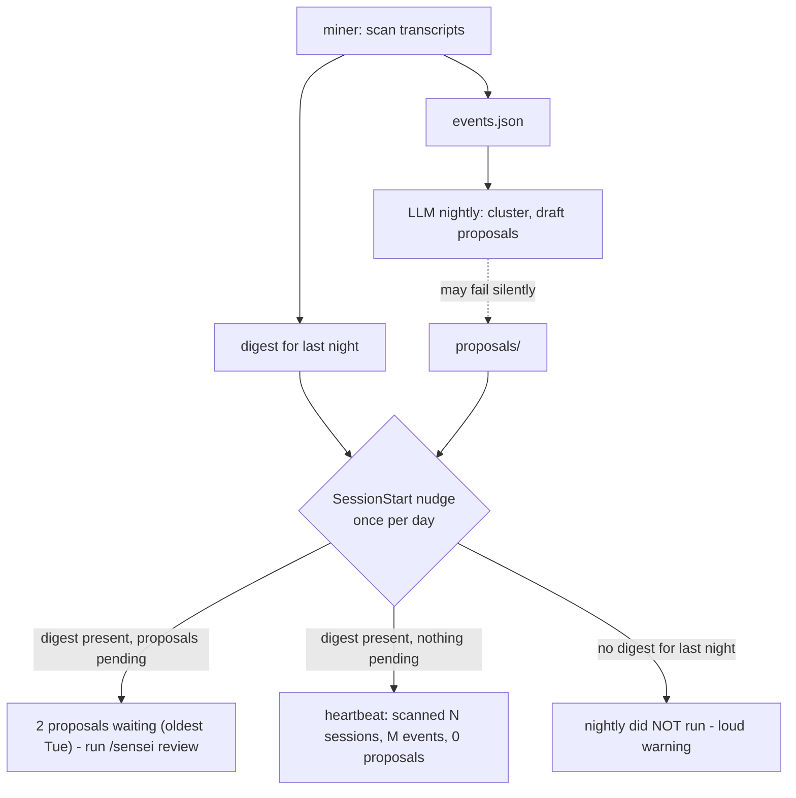
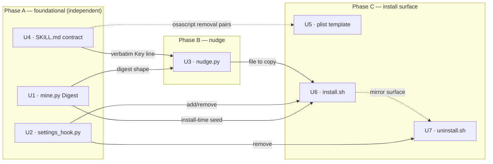

# Nightly Digest and Session Nudge - Plan

## Goal Capsule

- **Objective:** Every morning sensei proves it patrolled — a deterministic nightly digest plus a once-per-day in-session line that replaces the never-seen 05:30 notification and makes a broken run unmistakable.
- **Product authority:** This document; open product questions go to the repo owner.
- **Open blockers:** None.

---

## Product Contract

### Summary

The miner writes a dated digest artifact every night before the LLM stage runs, so a missing digest is itself the failure signal. A SessionStart hook prints one line, at most once per day, carrying the payload: heartbeat on quiet nights, pending-proposal count when there is something to review, or a loud "nightly did not run" when the digest is absent. The osascript success notification is removed, and review starts storing each accepted pattern's pre-acceptance event count so a future track-record slice has baselines from day one.

### Problem Frame

The user has never seen the 05:30 macOS notification — it fires while they are asleep and evaporates. They forget to run `/sensei review` most days, and when they do, recent mornings showed zero proposals, which today is indistinguishable from a silently failed run: the launchd chain aborts without any signal on miner failure (`sh.sensei.plist.template:31`, `&&` with no failure branch). The verification cost is real — the user has resorted to asking a separate Claude session to investigate whether the nightly ran at all. Most mornings of a well-tuned sensei are zero-proposal mornings, so the ambiguous quiet state is the product's most-seen surface. Separately, the user wants to know whether accepted rules actually reduced friction, and today nothing stores the baseline that question needs.

### Key Decisions

- **The miner owns the digest, written before the LLM stage.** Only the deterministic layer can guarantee the artifact exists every night; a digest written by the LLM stage would vanish exactly when the chain breaks. This extends the miner's role beyond `events.json` into a human-facing artifact — a deliberate redraw of the ADR-0001 boundary that planning should capture in a new ADR.
- **Missing digest is the failure signal.** No separate failure marker, no failure notification. The nudge checks for last night's digest; absence means the run failed or never started.
- **The heartbeat always prints.** Even a nothing-happened morning gets one muted line. Silence is the exact ambiguity this slice exists to remove, so no state maps to no output.
- **In-session is the sole surface.** The osascript success notification (fired from `skill/SKILL.md:76`) is removed outright, not demoted. A day the user never opens Claude Code is a day sensei says nothing — accepted, since review happens in-session anyway.
- **The receipt seed ships now without a consumer.** One integer stored at accept time. Baseline history is unrecoverable retroactively; the reporting that consumes it is a later slice.

### Requirements

**Nightly digest**

- R1. Every nightly run writes a dated digest artifact from the deterministic miner stage, before the LLM stage runs; a failed or skipped LLM stage still leaves the digest.
- R2. The digest reports at minimum: sessions scanned, and event counts by type and by project (counts are post-cap — the miner caps at 400 events total / 15 per session). **No proposals section** — the miner runs before the LLM stage and cannot know proposals; pending state is read live by the nudge (see D1).
- R3. Each night's digest is a durable record — later runs do not overwrite earlier nights' entries, so "was sensei there Tuesday?" stays answerable.

**Session nudge**

- R4. A SessionStart hook shows exactly one sensei line in the first Claude Code session of each calendar day, and nothing in subsequent sessions that day — **in the healthy state (digest present)**. The failure line (R7) is exempt: it repeats every session until the digest appears or the day turns over (see D6). The line is delivered via the hook's `hookSpecificOutput.systemMessage` field, not plain stdout, which is not user-visible (see D7).
- R5. When last night's digest exists and no proposals are pending, the line is a heartbeat summarizing the digest (sessions scanned, events, zero proposals).
- R6. When proposals are pending, the line states the count and the age of the oldest, and names `/sensei review` as the action.
- R7. When no digest exists for last night, the line states loudly that the nightly did not run and where to look for the cause.
- R8. A night with no transcript activity still produces a digest and a muted heartbeat — "quiet night" is a reported state, not silence.

**Notification removal**

- R9. The osascript success notification is removed from the nightly flow; the session nudge is the only surface announcing nightly outcomes.

**Receipt seed**

- R10. When review applies an accepted proposal, the decision record additionally stores the pattern's pre-acceptance event count. No reporting, no delta math, no grace-period logic in this slice.

### Acceptance Examples

- AE1. **Covers R5.** Given the nightly ran and found 14 events across 6 sessions with no qualifying pattern, when the user opens their first session of the day, then they see one line like "sensei: last night scanned 6 sessions, 14 events, 0 proposals" and no other sensei output that day.
- AE2. **Covers R6.** Given 2 proposals written Tuesday remain unreviewed and today is Friday, when the first session of the day starts, then the line reports 2 proposals waiting with the oldest from Tuesday and points at `/sensei review`.
- AE3. **Covers R7.** Given launchd never fired (machine asleep) or the miner crashed, when the first session of the day starts, then the line states the nightly did not run — the state that previously required asking a separate Claude session to diagnose.
- AE4. **Covers R4.** Given the user opens five sessions in one day, then only the first prints a sensei line.
- AE5. **Covers R10.** Given the user accepts a proposal whose pattern had 5 supporting events, then the appended decision record carries that count; rejecting a proposal stores no count.

### Success Criteria

- "Did sensei run last night?" is answerable by reading one line at session start — never again by manual investigation.
- The nudge never nags: one line per day, at most two lines of terminal output.

### Scope Boundaries

Deferred for later slices:

- Friction-receipt reporting ("5 events → 0. Working.") and `/sensei status` — the track-record slice, which consumes this slice's digest and stored baselines.
- Consent-agenda batch review — no proposal-volume pain yet at ~0 proposals per morning.
- The Founding Report (install-time backfill) — distribution-facing, not daily-experience.
- A "patterns brewing below threshold" digest section — sub-threshold patterns have no stable identity across runs (clustering is LLM-semantic), so the claim cannot be made reliably.
- Any notification channel outside Claude Code sessions.

### Dependencies / Assumptions

- Registering a SessionStart hook means the install surface writes into the user's Claude Code settings — the first time sensei touches config outside its own directory. Install must be idempotent and uninstall must remove the hook.
- The digest-in-miner decision needs a short ADR amending the ADR-0001 boundary (miner emits a human-facing artifact, still zero-token and deterministic).
- The miner stays stdlib-only (ADR-0008) and copy-installed (ADR-0009); the digest and nudge must not add dependencies.
- The pre-acceptance event count is **not** derivable from the proposal's 2–3 evidence quotes (they under-count the cluster). Nightly must write an explicit `Supporting events: N` field — the cluster size it already computed — on each proposal; review copies it to `baseline` on accepted decisions (see D11). Verified `decisions.jsonl` currently has no such field (`skill/SKILL.md:97-98`).
- **User-visible channel (verified empirically 2026-07-19, CC v2.1.215):** a SessionStart hook's plain stdout is context-only (invisible in the terminal); `systemMessage` **nested** in `hookSpecificOutput` is also invisible; a **top-level** `systemMessage` field renders to the user, as a **plain/muted line** (not a yellow warning banner) — so R5/R8's "muted heartbeat" holds. The Nudge uses the top-level form (see D7). Hook execution measured ~30 ms — negligible vs. Claude Code's own startup (e.g. MCP auth), but it blocks the prompt, so keep `nudge.py` lean.
- **All digest dates and the nudge's 05:30 boundary are local time.** The miner's `generated_at` stays UTC but must not feed the date logic (off-by-one "did not run" near midnight otherwise).

### Outstanding Questions

All resolved in the grilling pass — see **Design Resolutions** below:

- Digest location/format/retention → per-day JSON under `digests/`, unbounded (D2, D3).
- "First session of the day" → `nudge-state` date file, success-only writes (D6, D9).
- Hook implementation → separate stdlib `nudge.py`, not a shell one-liner or `mine.py` subcommand (D4).
- Source of the pre-acceptance event count → a new `Supporting events: N` field on the proposal, not evidence quotes or a re-scan (D11).

### Sources / Research

- `docs/ideation/2026-07-18-sensei-perceived-usefulness-ideation.html` — ideas 2 (Proof-of-Patrol Digest), 4 (in-session discovery half), 3b (receipt baseline), 5 (loud failure, subsumed by R7); verified against the repo at commit `e1aa379`.
- Fresh-context verification (2026-07-19): `sh.sensei.plist.template:31` chains miner and skill with `&&`, no failure branch; `skill/SKILL.md:75-77` writes a one-line file and notifies "N proposals" even at 0; `skill/SKILL.md:97-98` decision records carry no baseline field; `mine.py:172` writes only `events.json`; `install.sh` registers no hooks.
- ADRs 0001 (deterministic miner), 0002 (nightly proposes, review applies — untouched by this slice), 0008 (stdlib-only), 0009 (copy install).
- New ADRs written in the grilling pass: **0014** (digest is a deterministic miner artifact, amends 0001) and **0015** (in-session nudge is the sole announcement surface, via `settings.json` SessionStart hook).

---

## Design Resolutions (grilling 2026-07-19)

Resolved in a full grilling pass; this is the implementation contract. Load-bearing decisions recorded in **ADR-0014** (digest) and **ADR-0015** (nudge). Glossary terms `Digest`, `Nudge`, `Baseline` updated in `CONTEXT.md`.

### Digest (miner-owned)

- **D1. Miner-only content, no proposals section.** Fields: `date`, `generated_at`, `sessions_scanned`, `events_total`, `by_type`, `by_project`. Counts are post-cap (400 total / 15 per session). Proposal state is read live by the nudge (supersedes R2's "proposals section").
- **D2. Per-day JSON files** at `~/.claude/sensei/digests/YYYY-MM-DD.json`, dated by run date (local). Chosen over a single append file and over markdown: durable by construction (R3), trivially parseable, human-inspectable. Written by the miner alongside `events.json` in the same zero-token scan.
- **D3. Unbounded retention** — tiny files; consistent with `proposals/`.

### Nudge (`nudge.py` via SessionStart hook)

- **D4. Separate stdlib `nudge.py`**, copy-installed alongside `mine.py`. Keeps the miner's "only reader of raw transcripts" identity clean; the nudge reads digest + `proposals/` + `decisions.jsonl`. Testable.
- **D5. Failure detection.** `expected_date = today if now ≥ 05:30 local else yesterday`; warn iff `digests/<expected_date>.json` absent. 05:30 is a commented constant mirroring the plist. No grace margin.
- **D6. Success latches, failure repeats.** A success nudge writes the state file; the failure line does not, so it reprints every session until the digest appears or the day turns over. Resolves R4-vs-R7 and lets a transient wake-race warning self-heal.
- **D7. Delivery via a top-level `systemMessage` field** in the hook's JSON stdout: `{"systemMessage": "<line>"}`. Verified empirically (2026-07-19, CC v2.1.215): plain stdout is context-only (invisible); `systemMessage` **nested** in `hookSpecificOutput` is invisible; **top-level `systemMessage` renders to the user.** `nudge.py` builds the JSON with stdlib `json`. Failure line only: also emit `hookSpecificOutput.additionalContext` pointing Claude at `logs/nightly.log`. The SessionStart hook runs **synchronously and blocks the prompt**, so `nudge.py` must stay lean — measured ~30 ms for a minimal hook; keep imports and file I/O small. (Absolute `python3` path required — see D13; a bare `python3` under a GUI-launched minimal PATH can resolve to the `/usr/bin/python3` CLT stub and hang startup.)
- **D8. Self-trigger guard.** The launchd command sets `SENSEI_NIGHTLY=1` **on the `claude` invocation** (`… && SENSEI_NIGHTLY=1 claude -p …`, or `export` before the `&&` chain); `nudge.py` exits immediately when set, so the nightly's own `claude -p` doesn't consume the user's first real session. **Trap:** prefixing the assignment onto `mine.py` (`SENSEI_NIGHTLY=1 python3 mine.py … && claude …`) scopes it to `mine.py` only — `claude` and its hook child run unguarded, and the nudge self-suppresses the user's first session *every day*. `mine.py` spawns no hooks and doesn't need the var.
- **D9. State file** `~/.claude/sensei/nudge-state` (one line, local date), written only by the success path. Matcher: all SessionStart sources. Simultaneous-session duplicate accepted (no lock).
- **D10. Pending proposals.** Pending = proposal keys not in `decisions.jsonl`. Pin the proposal `Key` line to a parseable format in SKILL.md; report exact count + oldest containing file's date, degrading to a countless "since `<date>`" line on parse miss. Degradation errs toward a **false "proposals waiting"** (over-remind, never under-remind).
- **D10a. State precedence.** No digest → failure line (D5/D6). Digest present + pending > 0 → pending line. Digest present + pending == 0 → heartbeat.

### Baseline seed

- **D11.** Nightly writes `- **Supporting events:** N` (cluster size) on each proposal; review copies it to `"baseline": N` on accepted decisions only. Nothing reads it this slice. Corrects the Dependencies claim (the count is not in the evidence quotes).

### Notification removal

- **D12.** Delete SKILL.md nightly step 6 (osascript); shrink the plist allowlist to `Read,Edit(__HOME__/.claude/sensei/**)`; fix the stale plist comment. No notification replaces it.

### Install / uninstall

- **D13.** Register the hook in `~/.claude/settings.json` (user-global) via a repo-resident, unit-tested `settings_hook.py` (`add`/`remove`), shared by both scripts. Idempotent upsert by `nudge.py` marker; absolute `python3` + `nudge.py` paths resolved at install; `mkdir digests/`.
- **D14.** New `uninstall.sh` removes hook + launchd job + skills dir, preserves `~/.claude/sensei/` state (protects `decisions.jsonl`). Runs from the clone, like `install.sh`.

### Tests

- Unit tests for `nudge.py` (date boundary, latching, env guard, pending count + degradation, line formats), `mine.py` digest (contents, R3 durability), and `settings_hook.py` (add/remove edge cases). Bash orchestration scripts not unit-tested.

---

## Planning Contract (ce-plan, 2026-07-19)

**Product Contract preservation:** unchanged. The Design Resolutions above (D1–D14, D10a) are locked; this section only sequences them into build order. Every unit traces to a D-item; no product decision is reopened.

### Build order & dependencies

Three phases. Phase A units are mutually independent and can land in any order (or in parallel). Phase B consumes Phase A. Phase C wires the installed surface last, once the artifacts it copies and registers exist.

| Unit | Title | D-items | R-items | Depends on |
|------|-------|---------|---------|------------|
| U1 | Miner writes per-day Digest | D1, D2, D3 | R1, R2, R3, R8 | — |
| U2 | `settings_hook.py` add/remove | D13 | — | — |
| U3 | `nudge.py` SessionStart logic | D4, D5, D6, D7, D8, D9, D10, D10a | R4, R5, R6, R7, R8 | U1, U4 |
| U4 | SKILL.md contract changes | D10, D11, D12 | R9, R10 | — |
| U5 | plist template | D8, D12 | R9 | U4 (logical) |
| U6 | install.sh registers hook | D13 | R4 | U1, U2, U3 |
| U7 | uninstall.sh (new) | D14 | — | U2, U6 (logical) |

**Two cross-unit format contracts** — get these verbatim or tests pass green while production mis-parses:

1. **Key line (U4 → U3).** U4 pins the *literal* proposal `Key` line string; U3's pending parser and its test fixtures must reproduce that exact string. A drift is silent: U3 tests using their own fixture string stay green while real proposal files fail to parse.
2. **Local-date filename / boundary (U1 ↔ U3).** U1's digest filename and U3's `expected_date` each derive from **local** time independently; `generated_at` stays UTC and must never feed date logic. The seam is the off-by-one "did not run" false alarm near midnight (see Risks).

---

## Implementation Units

### U1. Miner writes per-day Digest

- **Goal:** `mine.py` writes a dated Digest JSON alongside `events.json` in the same scan, so the Digest's presence proves the patrol ran and its absence is the failure signal.
- **Requirements:** R1, R2, R3, R8; D1, D2, D3. ADR-0014.
- **Dependencies:** none.
- **Files:** `mine.py`, `tests/test_mine.py` (extend), `install.sh` (mkdir — see U6; the dir is also created defensively here).
- **Approach:**
  - After the existing `events.json` write in `main()`, compute Digest fields from the already-scanned `all_events` (post-cap): `date` (local `YYYY-MM-DD`), `generated_at` (existing UTC ISO), `sessions_scanned`, `events_total` (`len(all_events)`), `by_type` (count per event `type`), `by_project` (count per event `project`). No proposals field (D1 — the miner cannot know them).
  - **Digest path derives from `--out`'s parent:** `os.path.join(os.path.dirname(args.out), "digests", f"{local_date}.json")`, with `os.makedirs(..., exist_ok=True)`. This is deliberate and load-bearing for two reasons the implementer must not "fix": (a) the plist runs `mine.py --days 1` with **no `--out`**, so it takes the default live path and Digests land at `~/.claude/sensei/digests/` — **U1 needs no plist change**; (b) tests pass a tmp `--out`, so the Digest side-write lands in the tmp dir and never touches live state. Do **not** add a redundant `--digest-dir` flag.
  - `date` uses `dt.datetime.now().date()` (local, naive) — **not** the UTC `generated_at`. This is the U1↔U3 local-time contract.
  - R3 durability is free: per-day filename means a later run the same day overwrites only today's file; other days' files are untouched.
  - R8: a zero-event scan still writes a Digest (empty `by_type`/`by_project`, `events_total: 0`).
- **Patterns to follow:** mirror the existing `out = {...}` dict + `os.makedirs` + `json.dump(..., indent=2)` block at `mine.py:167-176`.
- **Test scenarios** (`tests/test_mine.py`, reusing the `run_mine` helper — extend it to also locate `<tmp>/digests/<date>.json`):
  - Digest exists after a run and carries all six fields with correct types.
  - `by_type` / `by_project` counts match the events written to `events.json` and are post-cap (assert against the fixture's known 3-event, 2-project shape).
  - `events_total` equals `len(events)` in the sibling `events.json`.
  - Covers R3. Two runs into the same `--out` dir on the same day: the Digest file is present and current; assert the write does not raise and the file parses (durability across same-day reruns).
  - Covers R8. A projects dir that yields zero events still writes a Digest with `events_total: 0` and empty `by_type`/`by_project`.
  - `date` is the local calendar date, distinct in source from the UTC `generated_at` (assert `date` matches `datetime.now().date()`, not derived from `generated_at`).
- **Verification:** `python3 -m unittest discover tests` green; a manual `python3 mine.py --days 1 --out <scratch>/events.json` leaves `<scratch>/digests/<today>.json` with sane counts.

### U2. `settings_hook.py` — register/deregister the SessionStart hook

- **Goal:** a repo-resident, unit-tested stdlib helper that idempotently adds sensei's SessionStart hook to `~/.claude/settings.json` and removes only sensei's entry — **without disturbing foreign hooks** the user already runs.
- **Requirements:** D13. ADR-0015.
- **Dependencies:** none.
- **Files:** `settings_hook.py` (new, repo root — copied to skills dir by U6), `tests/test_settings_hook.py` (new).
- **Approach:**
  - CLI: `settings_hook.py add --command <abs-cmd> --settings <path>` and `settings_hook.py remove --settings <path>`. `--settings` defaults to `~/.claude/settings.json`; tests pass a tmp path. `--command` is the fully-resolved `"<abs-python3> <abs-nudge.py>"` string (U6 resolves it at install; U2 does not hardcode paths).
  - **Marker-based upsert.** Tag sensei's hook object with a stable marker (e.g. a `"_sensei"` key on the hook entry, or match on the `nudge.py` substring in its command). `add` finds an existing sensei entry by marker and replaces it (idempotent — re-running install never duplicates); if absent, appends.
  - **Preserve foreign hooks — concrete, not hypothetical.** The target `~/.claude/settings.json` on this machine already holds a foreign SessionStart entry (`bash ".../.vibe-ads/ensure-statusline.sh"`, registered with no matcher). `hooks.SessionStart` is an **array of matcher-groups** (each `{ "matcher"?, "hooks": [ { "type": "command", "command": … } ] }`); `add` must append sensei's group into that array and `remove` must delete **only** sensei's marked entry, leaving every other group byte-for-byte intact. This is the sharpest correctness risk in the unit. (Some tools register SessionStart hooks via a plugin mechanism rather than this file — U2 owns only entries that actually live in `settings.json`, so fixtures should use a generic foreign entry, not assume any specific tool's shape.)
  - **Matcher:** register under a matcher that fires on all SessionStart sources (startup, resume, clear) so the Nudge actually runs — an empty/`"*"` matcher per Claude Code's SessionStart schema (D9: "all SessionStart sources"). The D6/D9 latch dedups same-day repeat fires, so firing broadly is safe; firing narrowly would silence the Nudge.
  - Robustness: missing `settings.json` → treat as `{}` and create it on `add`; malformed JSON → fail loudly (non-zero exit, clear message) rather than silently clobbering the user's settings. Preserve unrelated top-level keys and key order where practical (`json.load`/`json.dump`, `indent=2`).
- **Patterns to follow:** stdlib `json` + `argparse`, same shape as `mine.py`'s `main()`; no third-party deps (ADR-0008).
- **Test scenarios** (`tests/test_settings_hook.py`, all against a tmp settings path):
  - `add` on a **missing** file creates `settings.json` with sensei's SessionStart hook under an all-sources matcher.
  - `add` on a file that **already contains a foreign SessionStart hook** (simulate a generic foreign matcher-group, e.g. the real `ensure-statusline.sh` no-matcher entry) appends sensei's entry and leaves the foreign entry byte-for-byte intact.
  - `add` run **twice** is idempotent — exactly one sensei entry, foreign entries untouched.
  - `add` preserves **unrelated top-level keys** (e.g. `model`, `permissions`) and other hook events (`Stop`, `PreToolUse`).
  - `remove` deletes **only** sensei's entry; a co-resident foreign SessionStart hook survives.
  - `remove` when no sensei entry exists is a no-op (exit 0, file unchanged).
  - `add`→`remove` round-trip restores the file to its pre-add hook set.
  - Malformed JSON input → non-zero exit, file not clobbered.
- **Verification:** unit tests green; the foreign-hook-preservation and idempotency scenarios are the gate.

### U3. `nudge.py` — the SessionStart Nudge

- **Goal:** a lean stdlib hook that prints exactly one sensei line via top-level `systemMessage`, following the D10a state precedence, latching once per day on success and repeating on failure.
- **Requirements:** R4, R5, R6, R7, R8; D4, D5, D6, D7, D8, D9, D10, D10a. ADR-0015.
- **Dependencies:** U1 (Digest shape/location), U4 (verbatim `Key` line for pending parse).
- **Files:** `nudge.py` (new, repo root — copied to skills dir by U6), `tests/test_nudge.py` (new).
- **Execution note:** **First step, before writing any nudge logic — re-confirm the channel.** Wire a 30-second throwaway SessionStart hook that emits `{"systemMessage":"probe"}` and confirm the line renders in a real Claude Code session. Top-level `systemMessage` is the *only* visible channel; plain stdout and `hookSpecificOutput.systemMessage` are invisible and fail silently (D7, verified 2026-07-19 CC v2.1.215). If this regressed in a newer CC build, the whole feature is dead on arrival — catch it here, not after writing 150 lines.
- **Approach** — evaluate in this order (D10a precedence):
  1. **Env guard (D8):** if `SENSEI_NIGHTLY` is set → exit immediately, no output. (The nightly's own `claude -p` fires SessionStart; this stops it consuming the user's real first session.)
  2. **Expected date (D5):** `expected_date = today if now ≥ 05:30 local else yesterday`, all local. `05:30` is a commented constant mirroring the plist. No grace margin.
  3. **Failure (R7, D5/D6):** if `digests/<expected_date>.json` is absent → emit the loud "nightly did not run" line as top-level `systemMessage`, **plus** `hookSpecificOutput.additionalContext` pointing Claude at `logs/nightly.log`. Do **not** write the state file (failure repeats every session until it heals). Exit.
  4. **Latch (D6/D9):** Digest present → if `nudge-state` holds today's local date, exit silently (already nudged today).
  5. **Pending vs heartbeat (D10a):** compute pending; if `pending > 0` emit the pending line (R6), else the heartbeat (R5/R8). Write `nudge-state = today` (local). Exit.
  - **Delivery (D7):** build `{"systemMessage": "<line>"}` (failure adds `hookSpecificOutput.additionalContext`) with stdlib `json`, print to stdout. Nothing else on stdout.
  - **Pending computation (D10):** parse the verbatim `Key` line (U4 contract) from every `proposals/*.md`; pending keys = those not present as a `key` in `decisions.jsonl`. Report exact count + the oldest containing file's date (from the `YYYY-MM-DD.md` filename). On any parse miss, degrade to a countless "proposals waiting since `<date>`" line — err toward a **false "waiting"** (over-remind, never under-remind).
  - **Leanness (D7):** keep imports and file I/O minimal — the hook blocks the prompt (~30 ms budget). Wrap the body so any unexpected error exits silently rather than disrupting session start.
- **Patterns to follow:** stdlib `json`/`os`/`datetime` like `mine.py`; read paths under `~/.claude/sensei/` (`digests/`, `proposals/`, `decisions.jsonl`, `nudge-state`), all overridable via an env var or arg so tests point at a tmp dir.
- **Test scenarios** (`tests/test_nudge.py`, tmp sensei dir, injected "now"):
  - Covers R4/D8. `SENSEI_NIGHTLY=1` → no output, no state write.
  - Covers R7/D5. Digest for `expected_date` absent → failure line present in top-level `systemMessage`, `additionalContext` names `logs/nightly.log`, state file **not** written.
  - Covers R7/D6. Failure repeats: two consecutive invocations both emit the failure line (no latch).
  - Covers R5/R8. Digest present, zero pending → heartbeat line summarizing sessions/events/0 proposals; state written.
  - Covers R6. Two undecided proposals in a Tuesday file, today Friday → pending line reports count 2 and oldest = Tuesday, names `/sensei review`.
  - Pending excludes decided keys: a proposal whose `Key` appears in `decisions.jsonl` is not counted.
  - **Legacy/degrade (D10):** a proposal file with no parseable `Key` line → degrade to countless "since `<date>`" line, no crash, err toward over-remind.
  - Covers AE4/D9. Second invocation same local day in the healthy state → silent (latched).
  - **Local-time boundary (D5):** with a fixed `expected_date` file present, `now` at 05:29 vs 05:31 selects yesterday vs today; a near-local-midnight `now` does not produce a spurious "did not run".
  - Malformed `decisions.jsonl` / Digest JSON → nudge does not crash the session (silent or degrade).
- **Verification:** unit tests green; the throwaway-hook channel probe (execution note) confirmed before logic; a manual install shows the heartbeat once and then silence on the second session same day.

### U4. SKILL.md — Key line, Supporting-events, baseline, osascript removal

- **Goal:** make the proposal `Key` line machine-parseable, carry the cluster size onto each proposal and onto accepted decisions, and remove the osascript notification.
- **Requirements:** R9, R10; D10, D11, D12. ADR-0015.
- **Dependencies:** none (but U3 consumes the pinned Key-line format — see cross-unit contract).
- **Files:** `skill/SKILL.md`.
- **Approach:**
  - **Pin the Key line (D10):** in nightly step 4, fix the literal output line format so U3 can parse it — e.g. `- **Key:** `<target-file>::<slug>``. Whatever exact string is chosen becomes the U3 parse contract; U3's parser and fixtures must match it verbatim. Keep the existing intent prose but make the *emitted line* deterministic.
  - **Supporting events (D11):** add a new proposal field, `- **Supporting events:** N`, where N is the qualifying cluster's event count (the size step 3 already computes). Add it to the drafted-proposal field list (step 4) so every proposal carries it. The zero-proposal one-line file (step 5) is unaffected.
  - **Baseline on accept (D11):** in review step 3, when a proposal is **accepted**, copy its `Supporting events` value into the appended decision as `"baseline": N`. Rejected/edited-then-rejected decisions store no baseline. Update the decision-record JSON example (`skill/SKILL.md:96-98`) to show the additive optional field. This is the additive schema seam (below) — nothing reads it this slice.
  - **Delete osascript (D12):** remove nightly step 6 (the `osascript` notification) entirely. No replacement.
- **Patterns to follow:** match the existing `- **Field:**` bullet style in step 4 and the fenced JSON example in review step 3.
- **Test scenarios:** `Test expectation: none — SKILL.md is a prose/skill contract, not executable code.` Its two machine-facing guarantees are exercised elsewhere: the pinned Key-line format is covered by U3's pending-parse tests (which must use the verbatim string), and the `baseline` field is covered by the schema-seam note. When editing, keep the emitted Key line and the `baseline` field byte-consistent with U3's fixtures.
- **Verification:** the Key-line string in SKILL.md is identical to the string U3 parses; osascript no longer appears in the skill; review step 3 shows the conditional `baseline` on accept.

### U5. plist template — self-trigger guard, allowlist, comment

- **Goal:** guard the nightly's own `claude` run against the Nudge, drop the now-unused osascript permission, and correct the stale comment.
- **Requirements:** R9; D8, D12.
- **Dependencies:** logical pair with U4 (the allowlist drops `Bash(osascript:*)` because U4 removes the osascript step).
- **Files:** `sh.sensei.plist.template`.
- **Approach:**
  - **SENSEI_NIGHTLY on `claude` (D8):** set the env var on the `claude` invocation, not as a prefix on `mine.py`. Either `… && SENSEI_NIGHTLY=1 claude -p …` or `export SENSEI_NIGHTLY=1` before the `&&` chain. **Trap:** `SENSEI_NIGHTLY=1 python3 mine.py … && claude …` scopes the var to `mine.py` only, leaving `claude` and its hook child unguarded — the Nudge would then self-suppress the user's real first session every day. `mine.py` spawns no hooks and does not need the var.
  - **Shrink the allowlist (D12):** `--allowedTools 'Read,Edit(__HOME__/.claude/sensei/**)'` — remove `Bash(osascript:*)`.
  - **Fix the stale comment:** the current comment (`sh.sensei.plist.template:9-26`) describes the osascript notification and the old allowlist; update it to reflect the removed notification and the self-trigger guard.
- **Patterns to follow:** existing `<string>` ProgramArguments line at `sh.sensei.plist.template:31`; keep the `__HOME__` placeholders and the `&&`-abort-on-mine-failure behavior intact.
- **Test scenarios:** `Test expectation: none — plist template is launchd config, not unit-tested (Design Resolutions).` 
- **Verification:** the resolved plist (`sed __HOME__`) has `SENSEI_NIGHTLY=1` on `claude`, no `osascript` in the allowlist, and a comment matching current behavior; `plutil -lint` on a resolved copy passes.

### U6. install.sh — copy new scripts, mkdir digests, register the hook

- **Goal:** extend the installer to ship `nudge.py` + `settings_hook.py`, create `digests/`, and register the SessionStart hook with absolute paths resolved at install time.
- **Requirements:** R4; D13. ADR-0015.
- **Dependencies:** U1 (the miner the install-time seed invokes), U2 (`settings_hook.py add`), U3 (`nudge.py` to copy).
- **Files:** `install.sh`.
- **Execution note:** **before wiring the hook registration, re-run the U3 channel probe** end-to-end from an actually-installed hook (resolved absolute paths, real `settings.json`) to confirm the top-level `systemMessage` renders. The absolute-path requirement is load-bearing (below); confirm the boot path works before declaring the unit done.
- **Approach:**
  - Copy `nudge.py` and `settings_hook.py` into `$SKILLS_DIR` alongside `mine.py` (extend the `cp` block at `install.sh:16-17`).
  - `mkdir -p "$SENSEI_DIR/digests"` (extend the state-dir block at `install.sh:19-20`).
  - **Seed today's Digest so the Nudge doesn't false-alarm on install day.** After copying files and creating `digests/`, run the miner once synchronously — `python3 "$SKILLS_DIR/mine.py" --days 1` (default live `--out`, so it writes `events.json` + `digests/<today>.json` exactly as the nightly does). Without this, installing on an already-running system leaves `digests/<today>.json` absent until the next 05:30 run, and the latch-exempt failure line (D6) reprints the loud "nightly did not run" every session for ~a day on a night the patrol actually ran — and the scratch-`$HOME` Verification step below ("first session shows the heartbeat") would otherwise be unsatisfiable. Reuses the existing idempotent, zero-token miner — no new bootstrap logic. (Covers the common daytime install; a rare pre-05:30 install seeds the same local date and self-heals at the next 05:30 run.)
  - **Resolve absolute paths (D13, load-bearing):** resolve an absolute `python3` (e.g. `command -v python3`) and the absolute installed `nudge.py` path, and pass `"<abs-python3> <abs-nudge.py>"` as the command to `python3 settings_hook.py add --command …`. A bare `python3` under a GUI-launched minimal PATH can resolve to the `/usr/bin/python3` CLT stub and **hang boot** — never register a bare `python3`.
  - Call `settings_hook.py add` (idempotent upsert, U2) so re-running install never duplicates the hook and never disturbs foreign hooks.
- **Patterns to follow:** the existing idempotent `mkdir -p` / `cp` / `sed` structure and the `echo` progress lines; keep `set -euo pipefail`.
- **Test scenarios:** `Test expectation: none — bash orchestration, not unit-tested (Design Resolutions). settings_hook.py add is covered by U2.`
- **Verification:** run `./install.sh` against a scratch `$HOME`; confirm `nudge.py`, `settings_hook.py`, `mine.py` in the skills dir, `digests/` created **with today's Digest seeded by the install-time miner run**, exactly one sensei SessionStart hook in `settings.json` with an absolute `python3` command, foreign hooks intact, and re-running install leaves the hook count unchanged.

### U7. uninstall.sh — remove the surface, preserve state

- **Goal:** a new uninstaller that removes the hook, launchd job, and skills dir while preserving `~/.claude/sensei/` state (especially `decisions.jsonl`).
- **Requirements:** D14. ADR-0015.
- **Dependencies:** U2 (`settings_hook.py remove`), logical mirror of U6.
- **Files:** `uninstall.sh` (new, repo root).
- **Approach:**
  - Run from the clone like `install.sh` (`set -euo pipefail`, resolve `REPO_DIR`).
  - `settings_hook.py remove` (deletes only sensei's entry, U2) — but the installed copy lives in the skills dir; call the skills-dir copy *before* deleting the skills dir, or the repo copy. Prefer the repo copy so remove works even if the skills dir is already gone.
  - `launchctl unload` the plist if loaded, then remove `~/Library/LaunchAgents/sh.sensei.plist`.
  - `rm -rf "$SKILLS_DIR"` (the copied skill + scripts).
  - **Preserve `~/.claude/sensei/`** — do not touch `decisions.jsonl`, `proposals/`, `digests/`, `events.json`, `nudge-state`, `logs/`. Announce that state is preserved.
- **Patterns to follow:** mirror `install.sh`'s structure and `echo` progress lines; reuse `LABEL`, `PLIST_DST`, `SKILLS_DIR` variable names.
- **Test scenarios:** `Test expectation: none — bash orchestration, not unit-tested (Design Resolutions). settings_hook.py remove is covered by U2.`
- **Verification:** `./install.sh` then `./uninstall.sh` against a scratch `$HOME`; confirm the sensei SessionStart hook is gone (foreign hooks intact), the launchd job is unloaded and the plist removed, `$SKILLS_DIR` deleted, and everything under `~/.claude/sensei/` — decisions, proposals, digests — untouched.

---

## Schema seam: `decisions.jsonl` gains `baseline` (additive)

The only persisted-schema change is **additive and backward-compatible**:

- Accepted decisions gain an optional `"baseline": N` field (U4/D11); rejected decisions do not.
- Existing decision lines predate the field and stay valid — no migration, no backfill (Baseline history is unrecoverable retroactively; that is accepted, D11 / Key Decision "receipt seed").
- Nightly's cooldown/dedup (SKILL.md step 2) and the Nudge's pending logic (U3) key on `key`, never on `baseline`, so absence never breaks either path.
- Nothing reads `baseline` this slice — it is a seed for the deferred track-record slice.

---

## Risks & Dependencies

- **Silent-channel regression (highest).** The Nudge is invisible unless delivered as top-level `systemMessage`. Mitigation: the U3/U6 throwaway-hook probe is a hard first step, not a note. A newer CC build changing hook rendering would surface here.
- **Boot hang from a bare `python3` (high).** A GUI-launched minimal PATH can hit the `/usr/bin/python3` CLT stub and hang session start. Mitigation: U6 resolves and registers an absolute `python3` + absolute `nudge.py`.
- **Clobbering foreign SessionStart hooks (high, concrete).** `~/.claude/settings.json` already carries a foreign SessionStart entry (`ensure-statusline.sh`, no matcher). Mitigation: U2's marker-scoped add/remove with explicit foreign-entry-preservation tests.
- **False failure signal on install day (medium, concrete).** Installing on an already-running system leaves `digests/<today>.json` absent until the next 05:30 run, so the latch-exempt failure line would cry wolf all day. Mitigation: U6 seeds today's Digest by running the miner once at install.
- **Self-trigger every day (medium).** Misplacing `SENSEI_NIGHTLY` onto `mine.py` silently suppresses the user's real first session daily. Mitigation: U5 sets it on `claude`; documented trap.
- **Local-midnight off-by-one (medium).** UTC `generated_at` feeding date logic would cause spurious "did not run". Mitigation: U1/U3 use local dates for filenames and boundary; explicit boundary tests.
- **First write into `~/.claude/settings.json` (dependency).** Install now touches user-global config outside sensei's dir; uninstall must fully reverse it. Covered by U2 + U6 + U7 as a set.

---

## Verification Contract

- **Automated gate:** `python3 -m unittest discover tests` green, covering `mine.py` Digest (U1), `nudge.py` (U3), and `settings_hook.py` (U2). Bash orchestration (U5/U6/U7) and the SKILL.md prose contract (U4) are verified manually per their unit Verification lines.
- **Existing tests:** `tests/test_mine.py` is **unaffected** — the Digest is a new sibling side-write into the `--out` parent dir; no existing assertion touches it, and `TemporaryDirectory` isolates the write. (`test_time_window` runs `mine.py` twice into the same tmp dir → the same-day Digest is overwritten harmlessly, asserted by nothing.) U1 extends this file rather than replacing any case.
- **Channel probe (manual, gating U3 & U6):** top-level `systemMessage` renders in a live CC session before nudge logic and before install wiring are declared done.
- **End-to-end (manual):** install against a scratch `$HOME` (install seeds today's Digest, U6); first session shows the heartbeat, second session same day is silent; delete the seeded Digest → the loud failure line appears and repeats; uninstall reverses the surface and preserves state.
- **Live-state safety:** every miner/nudge test run uses fixtures or an explicit tmp `--out`/sensei dir — never the live `~/.claude/sensei/events.json` or `decisions.jsonl`.

---

## Definition of Done

- All seven units landed on branch `worktree-feat+nightly-digest-session-nudge`; every D-item (D1–D14, D10a) traces to a shipped change.
- `python3 -m unittest discover tests` green, including the new U1/U2/U3 coverage.
- The osascript notification is gone from both SKILL.md and the plist allowlist (R9).
- Accepted decisions carry `baseline`; the Key line is machine-parseable; the Nudge parses it verbatim.
- `./install.sh` is idempotent, registers an absolute-path SessionStart hook, preserves foreign hooks, and creates `digests/`; `./uninstall.sh` fully reverses the surface and preserves `~/.claude/sensei/` state.
- The systemMessage channel is confirmed rendering in a live session; no bare `python3` is registered anywhere.
