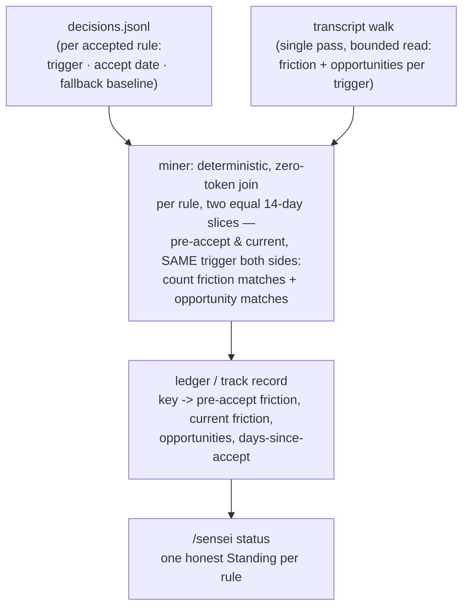

# Effectiveness Ledger - Plan

## Goal Capsule

- **Objective:** Prove whether each accepted rule actually reduced friction. Give measurable rules an LLM-authored trigger, deterministically measure each rule's before/after friction with that *same trigger* over two equal fixed-width slices, and report one honest Standing per rule via a new `/sensei status`. The `#16` baseline is a fallback for aged-out slices, not the primary measurement.
- **Product authority:** Florian (solo user and maintainer).
- **Open blockers:** None blocking planning. The `#16` baseline seed (review stores each accepted rule's pre-acceptance count) is still relied on for the fallback path.

## Product Contract

### Summary

Add a machine-checkable **trigger** — authored by the LLM at proposal time, only when one is genuinely inferable — to accepted rules, then have the deterministic miner count each rule's trigger matches (both friction events *and* total **opportunities**) over two equal fixed-width slices: the 14 days before acceptance and the most recent 14 days. Crucially the pre-acceptance number is **re-derived with the same trigger**, so both sides of the comparison use one instrument. A new `/sensei status` mode renders one honest line per rule with a four-value **Standing**: *Working*, *Not working*, *Inconclusive*, or *Not measurable yet*. Recorded in ADR-0016.

### Problem Frame

`#16` stores each accepted rule's pre-acceptance event count (`baseline`) and nothing reads it back (`skill/SKILL.md:37-38`). sensei can propose a rule but cannot show it earned its keep, or spot one that didn't. That gap is load-bearing: STRATEGY names friction-reduction rate as "the core outcome; the whole loop exists to move it," and trust-by-construction is hollow if sensei can't demonstrate its own proposals worked.

The obstacle is attribution. `events.json` today holds only raw friction text (`correction` / `denial` / `interrupt` / `repeat`), and deciding whether a given friction event "belongs to" the `ddev-prefix` rule is a semantic judgment — exactly the job the LLM does at nightly clustering, and exactly what a deterministic, zero-token miner cannot do. So the issue's own two framings collide: "pure deterministic join" versus "matching is fuzzy under LLM-semantic clustering." One has to give. The resolution is to make the match deterministic at the source by giving measurable rules an explicit trigger, and to refuse to fake a number for the rules that have none.

### Key Decisions

- D1. **Deterministic trigger over LLM attribution.** Measure via a machine-checkable trigger the LLM authors at proposal time (approach A), not by having the LLM attribute events to rules each night (approach B). A gives an exact, zero-token, reproducible number for the rules that matter most — tool-and-keyword-shaped rules like `ddev-prefix` — and keeps the measurement inside the deterministic miner (ADR-0001). This gives the miner a **second job — measurement, distinct from detection** — recorded in **ADR-0016**, which establishes it as *orthogonal to* ADR-0004 (the LLM authors the precision; the miner only executes it; the friction lexicon is untouched), not a bounded exception like ADR-0011. B's value lands only on the prose-y tail where every method is noisy, so it stays a deferred fast-follow.
- D2. **The opportunity denominator is measured, not inferred.** The miner counts not just friction events but *opportunities* — trigger-context occurrences regardless of friction. This is what lets a Standing be honest: *Working* means opportunities occurred and friction is gone, distinct from *Inconclusive* (the situation never came up). B cannot produce this; it sees only emitted friction, never its absence. The cost is a set of extra accumulations **inside the miner's existing single transcript walk** — *not* a second filesystem pass — O(records × active triggers) with triggers in the low dozens, keeping the miner the single greppable reader of transcripts (ADR-0001).
- D3. **Same instrument, same width, on both sides.** The pre-acceptance number is **re-derived with the rule's own trigger** over the 14 days before accept, and current friction is that same trigger over the last 14 days — two equal fixed-width slices. Comparing the LLM-clustered `baseline` #16 stored (a loose semantic count) against a tight deterministic trigger count would compare two rulers and systematically manufacture false *Working*; so the stored `baseline` is **demoted to a fallback seed**, used only when the pre-accept transcripts have aged out of the read window, in which case the line is flagged mixed-instrument or downgraded to *Inconclusive*. Fixed width also keeps the read **bounded** (ADR-0010): the miner reaches back far enough to cover the newest cohort's pre-accept slice, never "since the oldest rule ever." `days-since-accept` is reported as context, not as the measurement window.
- D4. **The trigger is optional and coverage grows in.** The LLM emits a trigger only when one is inferable; rules without one render *Not measurable yet*. Only rules accepted after trigger-authoring ships get measured, so the ledger starts sparse and fills over weeks. This is accepted as the honest cost of a forward-looking measurement, not papered over.
- D5. **Small-N humility + one shared grace.** sensei lives at small N (friction is rare, ADR-0004), so a Standing defaults *toward Inconclusive* when opportunities are few or the baseline tiny — a Standing is only as strong as its denominator. The grace period below which a rule is *Not measurable yet* is the **same ~14-day constant ADR-0012 already uses for escalation** (one knob, not two — it answers the identical "had a fair chance to stick?" question). The exact numeric cutoffs are a planning detail but must implement this humility bias, not invert it.
- D6. **Reportorial only — coexists with the existing escalation, cross-referenced in docs.** This milestone measures and reports; it never acts. The deterministic *Not working* signal runs in parallel with ADR-0012's fuzzy escalation (which drafts a hook proposal when a rule "still qualifies" past grace), with **no code wiring** between them in v1 — converging them (letting the ledger drive escalation) is acting on the measurement and stays firewalled. But the ledger **realizes the rate-comparison ADR-0012 explicitly deferred** ("needs a stored pre-acceptance rate — new state"), now built with *no* new state, so the cross-reference is **mandatory in docs, both directions** (ADR-0016 ↔ ADR-0012): the two are parallel lenses (action arm vs measurement arm) that can disagree on the same rule, and `/sensei status`' framing acknowledges this so a *Working* line beside a same-rule hook proposal doesn't read as self-contradiction. Convergence is future work, not built.
- D7. **Stateless recompute over the ledger.** The track record is recomputed from scratch each nightly run (`decisions.jsonl` × the mined event window), never accumulated across runs, consistent with the miner's stateless-wide-window design (ADR-0010).

### Visualization — the deterministic join

The accept date marks the intervention point; the ledger measures the friction line on either side of it with the *same* trigger over equal windows, and the opportunity count tells whether the situation even arose. The `baseline` #16 stored is a fallback only, for when the pre-accept slice has aged out.

### Requirements

**Trigger authoring (nightly / review)**

- R1. Each proposal MAY carry a machine-checkable trigger, authored by the LLM at proposal time, emitted only when one is genuinely inferable from the pattern. A rule with no inferable trigger carries none.
- R2. A trigger is limited to deterministic, auditable classes — tool name, keyword or substring, and path glob. Arbitrary regex is out of scope for v1.
- R3. On accept, the trigger is recorded in the decision record alongside the existing `baseline` (an additive schema seam). Its absence never affects cooldown or dedup, which key on the stable `key`.

**Measurement (miner)**

- R4. On each nightly run, the miner computes, per accepted rule that has a trigger, the count of matching friction events *and* matching opportunities (trigger-context occurrences regardless of whether they caused friction) over **two equal fixed-width slices**: the pre-accept slice (the ~14 days before the accept date) and the current slice (the most recent ~14 days).
- R5. The pre-accept friction number is **re-derived with the rule's own trigger** — the same instrument as the current number — not read from the `baseline` #16 stored. The stored `baseline` is used only as a **fallback** when the pre-accept transcripts have aged out of the read window; a fallback line is flagged mixed-instrument or downgraded to *Inconclusive*, never printed as a confident Standing.
- R6. The computation is zero-token and deterministic — a join of `decisions.jsonl` against the mined event window, accumulated inside the miner's **existing single transcript walk** (no second filesystem pass), with no LLM attribution and no new signal source.
- R7. The ledger is recomputed each run and not accumulated: rule key → pre-accept friction, current friction, opportunity count, days-since-accept.
- R8. A rule accepted more recently than the grace period yields no Standing yet (*Not measurable yet*) — too soon to judge — using the **same grace constant as the ADR-0012 escalation** (one shared knob).
- R9. At small N — few opportunities, tiny baseline — the Standing defaults *toward Inconclusive*, never a confident *Working*/*Not working*.

**Reporting (`/sensei status`)**

- R10. A new `/sensei status` mode renders one line per accepted rule that has a trigger, plus a framing note that its Standing is a *measurement* lens distinct from ADR-0012's escalation *action*, so the two may differ on the same rule without contradiction.
- R11. The Standing vocabulary is honest by construction: *Working* (opportunities present, friction gone), *Not working* (opportunities present, friction persists), *Inconclusive* (no opportunities this window), *Not measurable yet* (no trigger, or within the grace period).
- R12. `/sensei status` never renders a bare *Working* for a rule it cannot actually prove — the opportunity denominator gates the claim.

### Acceptance Examples

- AE1. Rule proven working.
  - **Given:** `ddev-prefix` accepted 2026-06-12 with a tool+keyword trigger; the trigger re-derived over the pre-accept slice yields 5/wk.
  - **When:** the current slice contains `artisan` calls (opportunities) but zero corrections.
  - **Then:** `ddev-prefix: 5/wk -> 0 since 2026-06-12. Working.`
- AE2. Rule not working.
  - **Given:** a rule with a trigger; the pre-accept slice yields ~4/wk.
  - **When:** the current slice still shows ~4/wk friction with opportunities present.
  - **Then:** `still 4/wk. Not working.`
- AE3. Inconclusive.
  - **Given:** a rule with a trigger.
  - **When:** the current slice contains no opportunities (the trigger context never occurred).
  - **Then:** the line reads *Inconclusive* — no bare *Working* despite zero friction (R12).
- AE4. Not measurable yet.
  - **Given:** a prose rule with no inferable trigger, or any rule accepted within the grace period.
  - **When:** `/sensei status` runs.
  - **Then:** the line reads *Not measurable yet*.
- AE5. Aged-out pre-accept slice (fallback).
  - **Given:** a rule whose pre-accept 14-day slice predates the transcripts still on disk, so the trigger cannot re-derive a same-instrument baseline.
  - **When:** `/sensei status` runs.
  - **Then:** the line falls back to the stored `baseline` #16 and is flagged mixed-instrument (or downgraded to *Inconclusive*) — never a confident Standing (R5, D5 small-N humility).

### Scope Boundaries

**Deferred for later**

- Approach B (LLM semantic attribution of events to rules) — a fast-follow, built only if the untriggerable tail proves annoying in practice.
- Generalizing opportunity counting into the broader clean-session / win signal (`#4`).

**Outside this milestone (firewall)**

- Acting on the measurement: retirement (`#5`), quarantine (`#7`), auto-apply.
- Converging the ledger with ADR-0012's escalation — letting a deterministic *Not working* Standing drive a hook proposal. The docs cross-reference between them (D6) exists; the *code* wiring does not.

### Dependencies / Assumptions

- The `#16` `baseline` seed is now a **fallback**, not the measurement (D3/R5). It is still relied on for the aged-out case, so its having shipped still matters. Verified: review copies `Supporting events` into `baseline` on accepted decisions (`skill/SKILL.md` review step 3), and nothing reads it yet (`skill/SKILL.md:37-38`).
- Trigger authoring must ship before measurement produces anything — the ledger is forward-looking, so only rules accepted after this lands are ever measured.
- The same-instrument baseline (R5) needs the pre-accept 14-day slice to still be on disk. For freshly-accepted rules this reaches back ~28 days, comfortably inside retained transcripts; older rules degrade to the fallback. This is why R5's fallback path exists rather than being an edge case.
- Assumes the miner remains the sole deterministic reader of transcripts (ADR-0001) and stays stateless over a bounded, recomputed window (ADR-0010) — the ledger widens the *read*, never the persisted state. The trigger field is additive to `decisions.jsonl`; absence is the default and breaks nothing (ADR-0011's dedup/cooldown key on `key`).

### Outstanding Questions

**Resolved in grilling (now settled above)**

- ~~New ADR vs 0004 exception~~ → new orthogonal ADR-0016 (D1).
- ~~Baseline instrument mismatch~~ → re-derive with the same trigger; #16 as fallback (D3/R5).
- ~~Second scan pass vs single walk, and the read horizon~~ → single walk, two fixed-width 14-day slices, bounded read (D2/D3/R6).
- ~~Grace period; coexistence cross-reference~~ → one shared grace with 0012 (D5/R8); mandatory bidirectional docs cross-reference, code firewalled (D6).

**Still deferred to planning**

- Exact trigger schema shape (the JSON on the decision record), and where the ledger artifact lives inside the miner's output.
- The numeric cutoffs separating *Working* from *Not working*, and the small-N thresholds (minimum opportunities / baseline before a confident Standing is allowed) — must implement D5's humility bias.
- **Keyword-trigger opportunity scope** — for a tool or glob trigger the opportunity unit is clean (a tool-use block; a path-matching file op), but for a keyword trigger, *which text* counts as an opportunity (user messages only? assistant text? tool inputs?) is genuinely fuzzy and risks a noisy denominator. Lean *Inconclusive* for the keyword class when the scope is ambiguous.
- Whether `/sensei status` reads the miner's latest ledger artifact or recomputes the join on demand.
- With re-acceptances/hook escalations, several accepted decisions can share one `key` — which accept date/slice anchors the ledger (earliest intervention point vs most recent).
