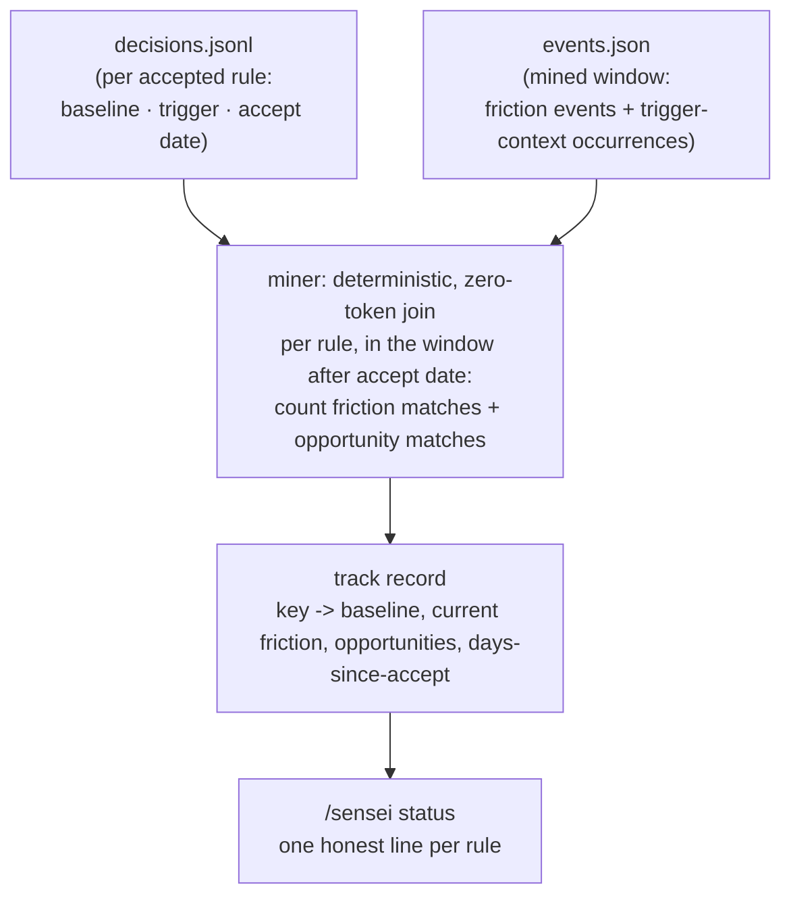

# Effectiveness Ledger - Plan

## Goal Capsule

- **Objective:** Prove whether each accepted rule actually reduced friction. Consume the `#16` baseline, deterministically measure each rule's before/after friction against it, and report one honest line per rule via a new `/sensei status`.
- **Product authority:** Florian (solo user and maintainer).
- **Open blockers:** None blocking planning. Depends on the `#16` baseline seed having shipped (review stores each accepted rule's pre-acceptance count).

## Product Contract

### Summary

Add a machine-checkable trigger — authored by the LLM at proposal time, only when one is genuinely inferable — to accepted rules, then have the deterministic miner count each rule's trigger matches (both friction events *and* total opportunities) in the window after its acceptance date. A new `/sensei status` mode renders one honest line per rule: proven *Working*, *Not working*, *Inconclusive*, or *Not measurable yet*.

### Problem Frame

`#16` stores each accepted rule's pre-acceptance event count (`baseline`) and nothing reads it back (`skill/SKILL.md:37-38`). sensei can propose a rule but cannot show it earned its keep, or spot one that didn't. That gap is load-bearing: STRATEGY names friction-reduction rate as "the core outcome; the whole loop exists to move it," and trust-by-construction is hollow if sensei can't demonstrate its own proposals worked.

The obstacle is attribution. `events.json` today holds only raw friction text (`correction` / `denial` / `interrupt` / `repeat`), and deciding whether a given friction event "belongs to" the `ddev-prefix` rule is a semantic judgment — exactly the job the LLM does at nightly clustering, and exactly what a deterministic, zero-token miner cannot do. So the issue's own two framings collide: "pure deterministic join" versus "matching is fuzzy under LLM-semantic clustering." One has to give. The resolution is to make the match deterministic at the source by giving measurable rules an explicit trigger, and to refuse to fake a number for the rules that have none.

### Key Decisions

- D1. **Deterministic trigger over LLM attribution.** Measure via a machine-checkable trigger the LLM authors at proposal time (approach A), not by having the LLM attribute events to rules each night (approach B). A gives an exact, zero-token, reproducible number for the rules that matter most — tool-and-keyword-shaped rules like `ddev-prefix` — and keeps the measurement inside the deterministic miner (ADR-0001). B's value lands only on the prose-y tail where every method is noisy, so it stays a deferred fast-follow.
- D2. **The opportunity denominator is measured, not inferred.** The miner counts not just friction events but *opportunities* — trigger-context occurrences regardless of friction. This is what lets a verdict be honest: *Working* means opportunities occurred and friction is gone, distinct from *Inconclusive* (the situation never came up). B cannot produce this; it sees only emitted friction, never its absence. The cost is a second targeted scan pass in the miner, accepted deliberately because it is what makes the headline claim true rather than hopeful.
- D3. **The trigger is optional and coverage grows in.** The LLM emits a trigger only when one is inferable; rules without one render *Not measurable yet*. Only rules accepted after trigger-authoring ships get measured, so the ledger starts sparse and fills over weeks. This is accepted as the honest cost of a forward-looking measurement, not papered over.
- D4. **Reportorial only — coexists with the existing escalation.** This milestone measures and reports; it never acts. The deterministic *Not working* signal will run in parallel with ADR-0012's existing fuzzy escalation (which already drafts a hook proposal when a rule "still qualifies" past a grace period), with no cross-reference between them in v1. Converging them — letting the ledger drive escalation — is acting on the measurement and stays firewalled. The eventual convergence is recorded as future work, not built.
- D5. **Stateless recompute over the ledger.** The track record is recomputed from scratch each nightly run (`decisions.jsonl` × the mined event window), never accumulated across runs, consistent with the miner's stateless-wide-window design (ADR-0010).

### Visualization — the deterministic join

The `baseline` field already marks the intervention point; the ledger measures the friction line on either side of it, and the opportunity count tells whether the situation even arose.

### Requirements

**Trigger authoring (nightly / review)**

- R1. Each proposal MAY carry a machine-checkable trigger, authored by the LLM at proposal time, emitted only when one is genuinely inferable from the pattern. A rule with no inferable trigger carries none.
- R2. A trigger is limited to deterministic, auditable classes — tool name, keyword or substring, and path glob. Arbitrary regex is out of scope for v1.
- R3. On accept, the trigger is recorded in the decision record alongside the existing `baseline` (an additive schema seam). Its absence never affects cooldown or dedup, which key on the stable `key`.

**Measurement (miner)**

- R4. On each nightly run, the miner computes, per accepted rule that has a trigger, the count of matching friction events *and* matching opportunities (trigger-context occurrences regardless of whether they caused friction) in the window after the rule's acceptance date.
- R5. The computation is zero-token and deterministic — a join of `decisions.jsonl` against the mined event window, with no LLM attribution and no new signal source.
- R6. The track record is recomputed each run and not accumulated: rule key → baseline, current friction rate, opportunity count, days-since-accept.
- R7. A rule accepted more recently than a grace period yields no verdict yet — too soon to judge — consistent with the ADR-0012 escalation grace.

**Reporting (`/sensei status`)**

- R8. A new `/sensei status` mode renders one line per accepted rule that has a trigger.
- R9. The verdict vocabulary is honest by construction: *Working* (opportunities present, friction gone), *Not working* (opportunities present, friction persists), *Inconclusive* (no opportunities this window), *Not measurable yet* (no trigger, or within the grace period).
- R10. `/sensei status` never renders a bare *Working* for a rule it cannot actually prove — the opportunity denominator gates the claim.

### Acceptance Examples

- AE1. Rule proven working.
  - **Given:** `ddev-prefix` accepted 2026-06-12 with `baseline` 5/wk and a tool+keyword trigger.
  - **When:** the post-accept window contains `artisan` calls but zero corrections.
  - **Then:** `ddev-prefix: 5/wk -> 0 since 2026-06-12. Working.`
- AE2. Rule not working.
  - **Given:** a rule with `baseline` 4/wk and a trigger.
  - **When:** the post-accept window still shows ~4/wk friction with opportunities present.
  - **Then:** `still 4/wk. Not working.`
- AE3. Inconclusive.
  - **Given:** a rule with a trigger.
  - **When:** the post-accept window contains no opportunities (the trigger context never occurred).
  - **Then:** the line reads *Inconclusive* — no bare *Working* despite zero friction (R10).
- AE4. Not measurable yet.
  - **Given:** a prose rule with no inferable trigger, or any rule accepted within the grace period.
  - **When:** `/sensei status` runs.
  - **Then:** the line reads *Not measurable yet*.

### Scope Boundaries

**Deferred for later**

- Approach B (LLM semantic attribution of events to rules) — a fast-follow, built only if the untriggerable tail proves annoying in practice.
- Generalizing opportunity counting into the broader clean-session / win signal (`#4`).

**Outside this milestone (firewall)**

- Acting on the measurement: retirement (`#5`), quarantine (`#7`), auto-apply.
- Converging the ledger with ADR-0012's escalation — letting a deterministic *Not working* verdict drive a hook proposal.

### Dependencies / Assumptions

- Depends on the `#16` baseline seed having shipped. Verified: review copies `Supporting events` into `baseline` on accepted decisions (`skill/SKILL.md` review step 3), and nothing reads it yet (`skill/SKILL.md:37-38`).
- Trigger authoring must ship before measurement produces anything — the ledger is forward-looking, so only rules accepted after this lands are ever measured.
- Assumes the miner remains the sole deterministic reader of transcripts (ADR-0001) and stays stateless over a wide window (ADR-0010). The trigger field is additive to `decisions.jsonl`; absence is the default and breaks nothing (ADR-0011's dedup/cooldown key on `key`).

### Outstanding Questions

**Deferred to planning**

- Exact trigger schema shape, and where the track record lives inside the miner's output.
- Grace-period length and the numeric thresholds separating *Working* from *Not working*.
- How opportunities are counted per trigger class — a tool trigger counts tool-use blocks, a keyword trigger scans text, a glob matches paths — and whether opportunity scanning reuses the existing session walk or adds a pass.
- Whether `/sensei status` reads the miner's latest output artifact or recomputes the join on demand.
