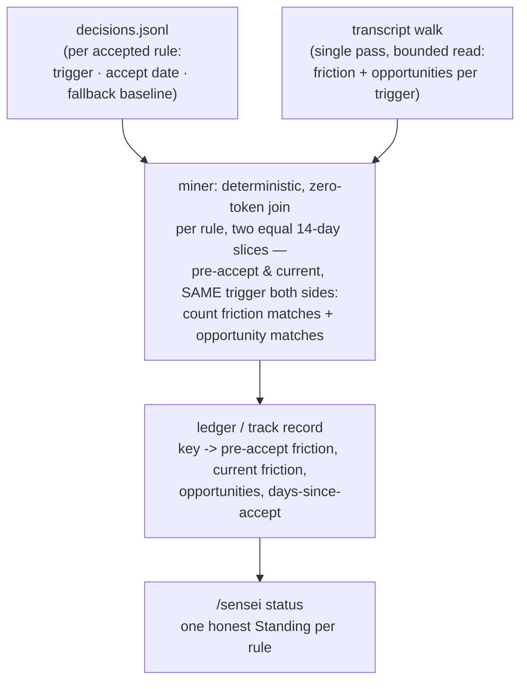
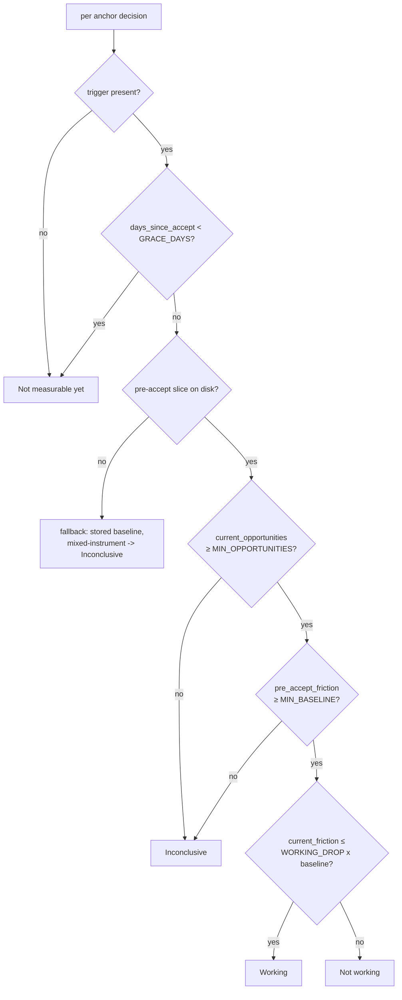

<!-- Product Contract preservation: unchanged. ce-plan enriched HOW only — the six
"Still deferred to planning" items are settled below in the Planning Contract; no R/D/AE
ID was rewritten. -->

# Effectiveness Ledger - Plan

## Goal Capsule

- **Objective:** Prove whether each accepted rule actually reduced friction. Give measurable rules an LLM-authored trigger, deterministically measure each rule's before/after friction with that *same trigger* over two equal fixed-width slices, and report one honest Standing per rule via a new `/sensei status`. The `#16` baseline is a fallback for aged-out slices, not the primary measurement.
- **Product authority:** Florian (solo user and maintainer).
- **Open blockers:** None blocking planning. The `#16` baseline seed (review stores each accepted rule's pre-acceptance count) is still relied on for the fallback path.

## Product Contract

### Summary

Add a machine-checkable **trigger** — authored by the LLM at proposal time, only when one is genuinely inferable — to accepted rules, then have the deterministic miner count each rule's trigger matches (both friction events *and* total **opportunities**) over two equal fixed-width slices: the 14 days before acceptance and the most recent 14 days. Crucially the pre-acceptance number is **re-derived with the same trigger**, so both sides of the comparison use one instrument. A new `/sensei status` mode renders one honest line per rule with a four-value **Standing**: *Working*, *Not working*, *Inconclusive*, or *Not measurable yet*. Recorded in ADR-0016.

### Problem Frame

`#16` stores each accepted rule's pre-acceptance event count (`baseline`) and nothing reads it back (`skill/SKILL.md:37-38`). sensei can propose a rule but cannot show it earned its keep, or spot one that didn't. That gap is load-bearing: STRATEGY names friction-reduction rate as "the core outcome; the whole loop exists to move it," and trust-by-construction is hollow if sensei can't demonstrate its own proposals worked.

The obstacle is attribution. `events.json` today holds only raw friction text (`correction` / `denial` / `interrupt` / `repeat`), and deciding whether a given friction event "belongs to" the `ddev-prefix` rule is a semantic judgment — exactly the job the LLM does at nightly clustering, and exactly what a deterministic, zero-token miner cannot do. So the issue's own two framings collide: "pure deterministic join" versus "matching is fuzzy under LLM-semantic clustering." One has to give. The resolution is to make the match deterministic at the source by giving measurable rules an explicit trigger, and to refuse to fake a number for the rules that have none.

### Key Decisions

- D1. **Deterministic trigger over LLM attribution.** Measure via a machine-checkable trigger the LLM authors at proposal time (approach A), not by having the LLM attribute events to rules each night (approach B). A gives an exact, zero-token, reproducible number for the rules that matter most — tool-and-keyword-shaped rules like `ddev-prefix` — and keeps the measurement inside the deterministic miner (ADR-0001). This gives the miner a **second job — measurement, distinct from detection** — recorded in **ADR-0016**, which establishes it as *orthogonal to* ADR-0004 (the LLM authors the precision; the miner only executes it; the friction lexicon is untouched), not a bounded exception like ADR-0011. B's value lands only on the prose-y tail where every method is noisy, so it stays a deferred fast-follow.
- D2. **The opportunity denominator is measured, not inferred.** The miner counts not just friction events but *opportunities* — trigger-context occurrences regardless of friction. This is what lets a Standing be honest: *Working* means opportunities occurred and friction is gone, distinct from *Inconclusive* (the situation never came up). B cannot produce this; it sees only emitted friction, never its absence. The cost is a set of extra accumulations **inside the miner's existing single transcript walk** — *not* a second filesystem pass — O(records × active triggers) with triggers in the low dozens, keeping the miner the single greppable reader of transcripts (ADR-0001).
- D3. **Same instrument, same width, on both sides.** The pre-acceptance number is **re-derived with the rule's own trigger** over the 14 days before accept, and current friction is that same trigger over the last 14 days — two equal fixed-width slices. Comparing the LLM-clustered `baseline` #16 stored (a loose semantic count) against a tight deterministic trigger count would compare two rulers and systematically manufacture false *Working*; so the stored `baseline` is **demoted to a fallback seed**, used only when the pre-accept transcripts have aged out of the read window, in which case the line is flagged mixed-instrument or downgraded to *Inconclusive*. Fixed width also keeps the read **bounded** (ADR-0010): the miner reaches back far enough to cover the newest cohort's pre-accept slice, never "since the oldest rule ever." `days-since-accept` is reported as context, not as the measurement window.
- D4. **The trigger is optional and coverage grows in.** The LLM emits a trigger only when one is inferable; rules without one render *Not measurable yet*. Only rules accepted after trigger-authoring ships get measured, so the ledger starts sparse and fills over weeks. This is accepted as the honest cost of a forward-looking measurement, not papered over.
- D5. **Small-N humility + one shared grace.** sensei lives at small N (friction is rare, ADR-0004), so a Standing defaults *toward Inconclusive* when opportunities are few or the baseline tiny — a Standing is only as strong as its denominator. The grace period below which a rule is *Not measurable yet* is the **same ~14-day constant ADR-0012 already uses for escalation** (one knob, not two — it answers the identical "had a fair chance to stick?" question). The exact numeric cutoffs are a planning detail but must implement this humility bias, not invert it.
- D6. **Reportorial only — coexists with the existing escalation, cross-referenced in docs.** This milestone measures and reports; it never acts. The deterministic *Not working* signal runs in parallel with ADR-0012's fuzzy escalation (which drafts a hook proposal when a rule "still qualifies" past grace), with **no code wiring** between them in v1 — converging them (letting the ledger drive escalation) is acting on the measurement and stays firewalled. But the ledger **realizes the rate-comparison ADR-0012 explicitly deferred** ("needs a stored pre-acceptance rate — new state"), now built with *no* new state, so the cross-reference is **mandatory in docs, both directions** (ADR-0016 ↔ ADR-0012): the two are parallel lenses (action arm vs measurement arm) that can disagree on the same rule, and `/sensei status`' framing acknowledges this so a *Working* line beside a same-rule hook proposal doesn't read as self-contradiction. Convergence is future work, not built.
- D7. **Stateless recompute over the ledger.** The track record is recomputed from scratch each nightly run (`decisions.jsonl` × the mined event window), never accumulated across runs, consistent with the miner's stateless-wide-window design (ADR-0010).

### Visualization — the deterministic join

The accept date marks the intervention point; the ledger measures the friction line on either side of it with the *same* trigger over equal windows, and the opportunity count tells whether the situation even arose. The `baseline` #16 stored is a fallback only, for when the pre-accept slice has aged out.

### Requirements

**Trigger authoring (nightly / review)**

- R1. Each proposal MAY carry a machine-checkable trigger, authored by the LLM at proposal time, emitted only when one is genuinely inferable from the pattern. A rule with no inferable trigger carries none.
- R2. A trigger is limited to deterministic, auditable classes — tool name, keyword or substring, and path glob. Arbitrary regex is out of scope for v1.
- R3. On accept, the trigger is recorded in the decision record alongside the existing `baseline` (an additive schema seam). Its absence never affects cooldown or dedup, which key on the stable `key`.

**Measurement (miner)**

- R4. On each nightly run, the miner computes, per accepted rule that has a trigger, the count of matching friction events *and* matching opportunities (trigger-context occurrences regardless of whether they caused friction) over **two equal fixed-width slices**: the pre-accept slice (the ~14 days before the accept date) and the current slice (the most recent ~14 days).
- R5. The pre-accept friction number is **re-derived with the rule's own trigger** — the same instrument as the current number — not read from the `baseline` #16 stored. The stored `baseline` is used only as a **fallback** when the pre-accept transcripts have aged out of the read window; a fallback line is flagged mixed-instrument or downgraded to *Inconclusive*, never printed as a confident Standing.
- R6. The computation is zero-token and deterministic — a join of `decisions.jsonl` against the mined event window, accumulated inside the miner's **existing single transcript walk** (no second filesystem pass), with no LLM attribution and no new signal source.
- R7. The ledger is recomputed each run and not accumulated: rule key → pre-accept friction, current friction, opportunity count, days-since-accept.
- R8. A rule accepted more recently than the grace period yields no Standing yet (*Not measurable yet*) — too soon to judge — using the **same grace constant as the ADR-0012 escalation** (one shared knob).
- R9. At small N — few opportunities, tiny baseline — the Standing defaults *toward Inconclusive*, never a confident *Working*/*Not working*.

**Reporting (`/sensei status`)**

- R10. A new `/sensei status` mode renders one line per accepted rule that has a trigger, plus a framing note that its Standing is a *measurement* lens distinct from ADR-0012's escalation *action*, so the two may differ on the same rule without contradiction.
- R11. The Standing vocabulary is honest by construction: *Working* (opportunities present, friction gone), *Not working* (opportunities present, friction persists), *Inconclusive* (no opportunities this window), *Not measurable yet* (no trigger, or within the grace period).
- R12. `/sensei status` never renders a bare *Working* for a rule it cannot actually prove — the opportunity denominator gates the claim.

### Acceptance Examples

- AE1. Rule proven working.
  - **Given:** `ddev-prefix` accepted 2026-06-12 with a tool+keyword trigger; the trigger re-derived over the pre-accept slice yields 5/wk.
  - **When:** the current slice contains `artisan` calls (opportunities) but zero corrections.
  - **Then:** `ddev-prefix: 5/wk -> 0 since 2026-06-12. Working.`
- AE2. Rule not working.
  - **Given:** a rule with a trigger; the pre-accept slice yields ~4/wk.
  - **When:** the current slice still shows ~4/wk friction with opportunities present.
  - **Then:** `still 4/wk. Not working.`
- AE3. Inconclusive.
  - **Given:** a rule with a trigger.
  - **When:** the current slice contains no opportunities (the trigger context never occurred).
  - **Then:** the line reads *Inconclusive* — no bare *Working* despite zero friction (R12).
- AE4. Not measurable yet.
  - **Given:** a prose rule with no inferable trigger, or any rule accepted within the grace period.
  - **When:** `/sensei status` runs.
  - **Then:** the line reads *Not measurable yet*.
- AE5. Aged-out pre-accept slice (fallback).
  - **Given:** a rule whose pre-accept 14-day slice predates the transcripts still on disk, so the trigger cannot re-derive a same-instrument baseline.
  - **When:** `/sensei status` runs.
  - **Then:** the line falls back to the stored `baseline` #16 and is flagged mixed-instrument (or downgraded to *Inconclusive*) — never a confident Standing (R5, D5 small-N humility).

### Scope Boundaries

**Deferred for later**

- Approach B (LLM semantic attribution of events to rules) — a fast-follow, built only if the untriggerable tail proves annoying in practice.
- Generalizing opportunity counting into the broader clean-session / win signal (`#4`).

**Outside this milestone (firewall)**

- Acting on the measurement: retirement (`#5`), quarantine (`#7`), auto-apply.
- Converging the ledger with ADR-0012's escalation — letting a deterministic *Not working* Standing drive a hook proposal. The docs cross-reference between them (D6) exists; the *code* wiring does not.

### Dependencies / Assumptions

- The `#16` `baseline` seed is now a **fallback**, not the measurement (D3/R5). It is still relied on for the aged-out case, so its having shipped still matters. Verified: review copies `Supporting events` into `baseline` on accepted decisions (`skill/SKILL.md` review step 3), and nothing reads it yet (`skill/SKILL.md:37-38`).
- Trigger authoring must ship before measurement produces anything — the ledger is forward-looking, so only rules accepted after this lands are ever measured.
- The same-instrument baseline (R5) needs the pre-accept 14-day slice to still be on disk. For freshly-accepted rules this reaches back ~28 days, comfortably inside retained transcripts; older rules degrade to the fallback. This is why R5's fallback path exists rather than being an edge case.
- Assumes the miner remains the sole deterministic reader of transcripts (ADR-0001) and stays stateless over a bounded, recomputed window (ADR-0010) — the ledger widens the *read*, never the persisted state. The trigger field is additive to `decisions.jsonl`; absence is the default and breaks nothing (ADR-0011's dedup/cooldown key on `key`).

### Outstanding Questions

**Resolved in grilling (now settled above)**

- ~~New ADR vs 0004 exception~~ → new orthogonal ADR-0016 (D1).
- ~~Baseline instrument mismatch~~ → re-derive with the same trigger; #16 as fallback (D3/R5).
- ~~Second scan pass vs single walk, and the read horizon~~ → single walk, two fixed-width 14-day slices, bounded read (D2/D3/R6).
- ~~Grace period; coexistence cross-reference~~ → one shared grace with 0012 (D5/R8); mandatory bidirectional docs cross-reference, code firewalled (D6).

**Settled during planning** (see `## Planning Contract` below)

- ~~Exact trigger schema shape + ledger artifact location~~ → PD1 (trigger = list of AND-ed `{kind,value}` clauses) and PD2 (`~/.claude/sensei/ledger.json`, overwritten each run).
- ~~Numeric Working/Not-working + small-N cutoffs~~ → PD4 (module constants, humility-biased decision tree).
- ~~Keyword-trigger opportunity scope~~ → PD3 (a compound keyword clause matches the tool input; a pure-keyword trigger matches user-message text only and leans *Inconclusive*).
- ~~`/sensei status` reads vs recomputes~~ → PD5 (reads `ledger.json`; the miner computes the Standing — ADR-0001 forbids the skill from reading transcripts).
- ~~Which accept date anchors a multi-decision key~~ → PD6 (earliest accepted decision *that carries a trigger*).

---

## Planning Contract

The six items the Product Contract deferred to planning, settled. These are HOW decisions; they do not touch the R/D/AE IDs above.

- **PD1. Trigger schema — a list of AND-ed clauses.** A trigger is a JSON array of clauses, all of which must match simultaneously; each clause is `{"kind": "tool" | "keyword" | "glob", "value": "<string>"}`. A single-class trigger is a one-element array. AND semantics are the only combinator in v1 (satisfies AE1's `tool+keyword` trigger: `[{"kind":"tool","value":"Bash"},{"kind":"keyword","value":"artisan"}]`). No `OR`, no nesting, no arbitrary regex (R2). On the **decision record** it is the additive field `"trigger": [...]` (R3). In the **proposal markdown** it is emitted as its own parse-contract line, mirroring `- **Key:**`: `- **Trigger:** [{"kind":"...","value":"..."}]` — one-line JSON, present only when the LLM inferred one (R1).
- **PD2. Ledger artifact — `~/.claude/sensei/ledger.json`, overwritten each run.** A distinct latest-only artifact beside `events.json`, not folded into `events.json` (keeps the detection output's schema stable) nor into `digests/` (those are dated, miner-only-knowledge proof-of-patrol; the ledger is a *join* against `decisions.jsonl`). Recomputed from scratch each run, never accumulated (D7, R7, ADR-0010). For test isolation the path is derived from `--out`'s directory, exactly as `digests/` already is.
- **PD3. Opportunity scope, per clause kind.** An **opportunity** is one transcript record satisfying *all* clauses at once. A `tool` clause is satisfied by a `tool_use` block of that name; a `glob` clause by a `tool_use` whose input contains a path matching the glob; a `keyword` clause by the substring appearing in the record's text. The keyword surface is the settled fuzzy point: when a keyword clause is **ANDed with a tool/glob clause** it matches that `tool_use`'s serialized input (precise — this is the `ddev artisan` case); a **pure-keyword** trigger (only keyword clauses) matches **user-message text only** — the least-noisy, most intent-bearing surface — and, because its denominator is inherently softer, leans *Inconclusive* (it is subject to the same small-N gate with no relaxation). Assistant prose is never an opportunity surface (noisy denominator). A **friction match** is an opportunity record that is *also* a friction event (`correction`/`denial`/`interrupt`) — so friction matches ⊆ opportunities by construction.
- **PD4. Numeric cutoffs — humility-biased, as module constants.** New constants near `mine.py`'s `REPEAT_*` block: `GRACE_DAYS = 14` (the *same* constant ADR-0012 uses — D5/R8), `SLICE_DAYS = 14` (reuse the friction window), `MIN_OPPORTUNITIES = 3` (current-slice floor for any confident Standing), `MIN_BASELINE = 2` (pre-accept friction floor), `WORKING_DROP = 0.5` (current friction must be ≤ half the baseline to read *Working*), `MAX_LEDGER_LOOKBACK_DAYS = 60` (bounds the read — ADR-0010). Decision tree (top to bottom, first match wins), computed **by the miner**:
  1. no trigger on the anchor decision → *Not measurable yet*
  2. `days_since_accept < GRACE_DAYS` → *Not measurable yet*
  3. pre-accept slice start is older than the earliest transcript record actually read → **fallback**: report stored `baseline` as context, flag mixed-instrument, render *Inconclusive* (never confident — R5, AE5)
  4. `current_opportunities < MIN_OPPORTUNITIES` → *Inconclusive* (covers AE3's "no opportunities" as the `=0` case, and small-N generally)
  5. `pre_accept_friction < MIN_BASELINE` → *Inconclusive* (tiny baseline, nothing to measure a drop from)
  6. `current_friction <= floor(WORKING_DROP * pre_accept_friction)` → *Working*
  7. else → *Not working*
- **PD5. `/sensei status` reads `ledger.json`; the miner computes the Standing.** Not a preference — ADR-0001 forbids any component but the miner from reading raw transcripts, so status cannot recompute the join. The miner writes the fully-classified Standing (PD4 tree) plus its raw counts into `ledger.json`; `/sensei status` renders. This also makes R12 true by construction — the LLM never re-derives a verdict, so it cannot manufacture a bare *Working*. A missing/stale `ledger.json` makes status say so, mirroring the nudge's failure line.
- **PD6. Anchor = the earliest accepted decision *carrying a trigger*, per `key`.** When re-acceptances/hook escalations give a `key` several accepted decisions, the ledger anchors to the earliest one that has a trigger — the first *measurable* intervention point. Its accept date sets both slice boundaries, its `baseline` is the fallback seed, its `trigger` is the instrument. Hook-tier and no-trigger decisions never anchor (they carry no `baseline`/trigger). `days_since_accept` is measured from this anchor as lifetime context (D3), not as the measurement window.

---

## High-Level Technical Design

The `## Product Contract` already carries the deterministic-join dataflow diagram. The one shape planning adds is the **Standing decision tree** (PD4) — the deterministic classifier the miner runs per rule, and the honest-by-construction guarantee's actual mechanism:

Where the code lands, at a glance:
- `mine.py` — new constants block; a `match_clause`/`is_opportunity` primitive (U2); a decisions-loader that collapses to per-`key` anchors and slice boundaries (U3); ledger accumulation folded into the *existing* single `mine_session` walk (U4); Standing classification + `ledger.json` write in `main()` (U4).
- `skill/SKILL.md` — trigger authoring in the two nightly proposal shapes and the review recording step, plus the `decisions.jsonl` schema note (U1); the new `## Mode: status` section (U5).
- `docs/adr/`, `README.md` — ADR-0016 to accepted, bidirectional ADR-0012 cross-reference, arg-hint (U6).

---

## Implementation Units

Dependency order. The trigger schema (U1) is defined first so both the authoring side (skill) and the reading side (miner) share one shape; the miner units (U2–U4) can be built and tested against synthetic `decisions.jsonl` before any real trigger is ever authored (the feature is forward-looking, D4).

### U1. Trigger schema + authoring in the skill

- **Goal:** Give proposals an optional machine-checkable trigger and persist it on accept — the additive seam the ledger reads (R1–R3, PD1).
- **Requirements:** R1, R2, R3; PD1.
- **Dependencies:** none.
- **Files:** `skill/SKILL.md`.
- **Approach:** In `## Mode: nightly` step 4, add to the **prose** and **habit-rule** proposal shapes an optional `- **Trigger:** <one-line JSON array>` line, authored only when a tool/keyword/glob matcher is genuinely inferable from the pattern; omit the line otherwise (a rule with no inferable trigger carries none). State the three clause kinds and the AND-array shape (PD1), and that arbitrary regex is out of scope. The hook proposal shape does **not** gain a trigger (hooks enforce, they aren't measured). In `## Mode: review` step 3, when recording an **accepted** prose/habit-rule decision, copy the proposal's `Trigger` array verbatim into the decision line as `"trigger": [...]` alongside the existing `baseline`; omit the field when the proposal had none. Update the `decisions.jsonl` schema block at the top of the skill (currently lines ~31–38) to document `trigger` as an optional additive field whose absence is the default and never affects cooldown/dedup (those key on `key`).
- **Patterns to follow:** the existing `- **Key:**` parse-contract line and the `baseline: N` copy-on-accept rule in review step 3 — trigger authoring/recording mirrors both exactly.
- **Test scenarios:** `Test expectation: none — SKILL.md is skill prose with no unit-testable surface.` Manual review verifies the schema block and both proposal shapes read consistently and the `- **Trigger:**` line format matches PD1.
- **Verification:** the schema block, the two proposal shapes, and review step 3 all describe the same `trigger` field and JSON shape; no contradiction with the `- **Key:**` contract.

### U2. Trigger-matching primitives in the miner

- **Goal:** Pure, deterministic functions that decide whether a transcript record is an opportunity for a trigger, and whether a friction event is a trigger match (PD3).
- **Requirements:** R2, R6; PD1, PD3.
- **Dependencies:** U1 (shares the PD1 schema).
- **Files:** `mine.py`, `tests/test_mine.py`.
- **Approach:** Add `match_clause(clause, *, tool_name, tool_input, user_text)` returning bool for the three kinds, and `is_opportunity(trigger, record_view)` returning True only when **all** clauses match the same record. Encode PD3's surface rules: a `keyword` clause ANDed with a `tool`/`glob` clause matches the `tool_input` string; a pure-keyword trigger matches `user_text` only; a `tool` clause matches the tool name; a `glob` clause uses `fnmatch` against paths in the tool input. Pure functions — no I/O, no transcript reads — so they unit-test in isolation.
- **Patterns to follow:** existing module-level helpers (`block_text`, `normalize_phrase`) — small, pure, stdlib-only; `glob`/`fnmatch` from stdlib for the glob kind.
- **Test scenarios:**
  - Covers AE1. `[{tool:Bash},{keyword:artisan}]` matches a `Bash` `tool_use` whose input contains `artisan`; does **not** match a `Bash` call without `artisan`, nor an `artisan` substring in a non-Bash call.
  - `tool` clause matches exact tool name only (`Bash` ≠ `BashOutput`).
  - `glob` clause `app/**/*.php` matches a file op on `app/Models/User.php`, rejects `resources/x.php`.
  - Pure-keyword trigger `[{keyword:ddev}]` matches user-message text containing `ddev`, and does **not** match an assistant-text-only occurrence (PD3 excludes assistant prose).
  - Empty/malformed trigger (`[]`, missing `kind`) → not an opportunity (no crash).
- **Verification:** the primitives return correct booleans for every scenario; running the miner over fixtures with no triggers present is unchanged (existing tests still pass).

### U3. Decisions loader + per-key anchor and slice boundaries

- **Goal:** Turn `decisions.jsonl` into the set of active measurement instruments the walk needs: per `key`, the anchor decision, its trigger, accept date, fallback baseline, the two 14-day slice boundaries, and the bounded read lookback (PD6, PD4).
- **Requirements:** R4, R5, R7, R8; PD4, PD6.
- **Dependencies:** U1 (schema).
- **Files:** `mine.py`, `tests/test_mine.py`.
- **Approach:** Add a pure function that reads `decisions.jsonl` (new miner input — default `dirname(--out)/decisions.jsonl`, overridable via a `--decisions` arg for test isolation), keeps only `accepted` decisions carrying a `trigger`, groups by `key`, and for each key selects the **earliest** such decision as the anchor (PD6). For each anchor compute: `accept_date`; pre-accept slice = `[accept_date - SLICE_DAYS, accept_date]`; current slice = `[now - SLICE_DAYS, now]`; carry `baseline` as the fallback seed. Derive the walk's bounded lookback = `min(MAX_LEDGER_LOOKBACK_DAYS, max over anchors of (now - (accept_date - SLICE_DAYS)))`, also floored by the existing repeat window so no existing behavior narrows.
- **Patterns to follow:** the existing decisions-shape doc in `skill/SKILL.md`; `parse_ts` for date handling; argparse additions mirror `--out`/`--projects-dir`.
- **Test scenarios:**
  - A single accepted+triggered decision → one anchor with correct slice boundaries.
  - Two accepted decisions same `key` (earlier + re-accept) → anchor is the **earliest triggered** one (PD6).
  - A `key` whose only accepted decision has `tier:"hook"` or no `trigger` → not an anchor.
  - Rejected/reject-* decisions → never anchors.
  - Lookback is bounded by `MAX_LEDGER_LOOKBACK_DAYS` even with a very old anchor; never narrower than the repeat window.
  - Missing/empty `decisions.jsonl` → empty anchor set, no crash (ledger simply has no rows).
- **Verification:** anchors, slice boundaries, and lookback are correct for each scenario; the loader is pure (no transcript read).

### U4. Single-walk ledger accumulation + `ledger.json` emission

- **Goal:** Fold per-trigger, two-slice friction/opportunity counting into the *existing* transcript walk (no second filesystem pass), classify each rule's Standing, and write `ledger.json` (R4–R9, D2, D3, PD2, PD4).
- **Requirements:** R4, R5, R6, R7, R8, R9; PD2, PD4.
- **Dependencies:** U2 (primitives), U3 (anchors).
- **Files:** `mine.py`, `tests/test_mine.py`.
- **Approach:** Extend `mine_session` (or thread accumulators through it) so that, as each record is already being read, it is tested against every active trigger via U2's primitives and, when it lands in a rule's pre-accept or current slice, increments that rule's opportunity count (and friction count if the record is a friction event). Track the **earliest record timestamp actually read** so U3's aged-out check (PD4 step 3) can fire per rule. In `main()`, after the walk, apply the PD4 decision tree per anchor and write `ledger.json` (PD2 location) with one row per rule: `{key, standing, trigger_present, pre_accept_friction, current_friction, current_opportunities, days_since_accept, fallback, baseline_seed}`. Emission mirrors the digest write already in `main()`.
- **Execution note:** the walk extension is where a regression could silently break existing detection — start by asserting existing fixture event counts are unchanged with triggers active, then add ledger assertions.
- **Patterns to follow:** the `digests/` write block in `main()` (derive dir from `--out`, `json.dump` indent=2); the single-pass discipline in `mine_session` (accumulate during the existing loop, never re-open files).
- **Test scenarios:**
  - Covers AE1. Anchor with pre-accept friction 5, current slice has ≥3 `artisan` opportunities and 0 corrections → `Working`.
  - Covers AE2. Pre-accept ~4, current ~4 with opportunities present → `Not working`.
  - Covers AE3. Current slice has 0 opportunities → `Inconclusive` (no bare *Working* despite 0 friction — R12).
  - Covers AE4. Anchor accepted within `GRACE_DAYS`, and a no-trigger key → `Not measurable yet`.
  - Covers AE5. Pre-accept slice older than the earliest record read → fallback: `Inconclusive`, `fallback:true`, `baseline_seed` populated.
  - Small-N: current opportunities = 2 (`< MIN_OPPORTUNITIES`) → `Inconclusive`; baseline = 1 (`< MIN_BASELINE`) → `Inconclusive`.
  - Single-walk proof: existing fixture friction/repeat counts are byte-for-byte unchanged when triggers are active (no second pass, no detection regression).
  - `ledger.json` is written to `dirname(--out)/ledger.json` with the documented row shape.
- **Verification:** every AE resolves to the specified Standing; `events.json`/`digests` outputs are unchanged vs. pre-U4; `python3 -m unittest discover tests` is green.

### U5. `/sensei status` mode

- **Goal:** A new interactive skill mode that reads `ledger.json` and renders one honest line per rule plus the ADR-0012 framing note (R10, R11, R12, PD5).
- **Requirements:** R10, R11, R12; PD5.
- **Dependencies:** U4 (defines `ledger.json` shape).
- **Files:** `skill/SKILL.md`, `README.md`.
- **Approach:** Add `## Mode: status` and extend the mode dispatch (`nightly | review | status`) and `argument-hint`. The mode **reads `~/.claude/sensei/ledger.json`** (never recomputes, never reads transcripts — PD5/ADR-0001), and renders one line per row using the AE line formats (`ddev-prefix: 5/wk -> 0 since 2026-06-12. Working.`), grouping or labelling *Not measurable yet* rules. Emit R10's framing note once: the Standing is a *measurement* lens, distinct from ADR-0012's escalation *action*, so a *Working* line can sit beside a same-rule hook proposal without contradiction. Fallback rows show the mixed-instrument flag. If `ledger.json` is missing or older than the newest digest, say so plainly (mirror the nudge failure posture) rather than rendering stale confidence.
- **Patterns to follow:** the `## Mode: nightly` / `## Mode: review` section structure and the "no dialog tool needed — this is a conversation" plain-text rendering style of review.
- **Test scenarios:** `Test expectation: none — SKILL.md prose.` Manual: dispatch reads `status`; the four Standings render per R11; the framing note is present; a missing `ledger.json` produces the honest failure line.
- **Verification:** the mode reads only `ledger.json`; the rendered vocabulary matches R11 exactly; the ADR-0012 coexistence note is present (R10).

### U6. Docs — ADR-0016 accepted, bidirectional 0012 cross-reference, arg-hint

- **Goal:** Land the mandatory bidirectional cross-reference (D6) and finalize doc state.
- **Requirements:** D6; ADR-0016.
- **Dependencies:** U1–U5 (design is final).
- **Files:** `docs/adr/0016-ledger-measures-via-llm-authored-triggers.md`, `docs/adr/0012-closing-the-loop-escalate-to-a-proposed-hook.md`, `README.md`.
- **Approach:** Flip ADR-0016 `status: proposed` → `accepted`. Add to ADR-0012 the reciprocal cross-reference (0016 realizes the rate-comparison 0012 deferred; the two are parallel action/measurement lenses, deliberately unwired in v1 — D6). Confirm ADR-0016's existing forward reference to 0012 reads correctly. Update `README.md` for the new `status` mode if it documents sensei's modes. `CONTEXT.md` already carries Trigger/Opportunity/Effectiveness ledger/Standing and the reframed Baseline — verify, don't rewrite.
- **Patterns to follow:** existing ADR frontmatter/status convention; the cross-reference phrasing already in ADR-0016's "Relationships" section.
- **Test scenarios:** `Test expectation: none — docs.` Manual: both ADRs reference each other; 0016 is `accepted`.
- **Verification:** bidirectional cross-reference present in both ADRs; no dangling "proposed" status.

---

## Verification Contract

- `python3 -m unittest discover tests` is green — the gate for every miner unit (U2–U4).
- Existing fixture-based tests (`test_mine.py`) pass **unchanged** with ledger code active — proof the second job did not regress detection (ADR-0001/0004 invariants intact).
- All five Acceptance Examples (AE1–AE5) are realized as passing miner tests in U4.
- The miner remains stdlib-only, single-transcript-pass, and stateless (no new persisted state; `ledger.json` is a recomputed latest-only artifact) — ADR-0008/0010/0001 hold.
- A manual `/sensei status` dispatch renders the four Standings and the ADR-0012 framing note, reading only `ledger.json`.

## Definition of Done

- Triggers can be authored (U1) and are recorded on accept; the `decisions.jsonl` schema documents the additive `trigger` field.
- The miner computes the effectiveness ledger inside its single walk and writes `ledger.json` each run, with Standings classified per the humility-biased PD4 tree.
- `/sensei status` renders one honest line per rule; no rule shows a bare *Working* it cannot prove (R12), and the measurement-vs-action framing (D6) is stated.
- ADR-0016 is accepted with the mandatory bidirectional ADR-0012 cross-reference.
- `install.sh` is unaffected (it already copies `mine.py` and the skill; no new files ship outside those). No launchd change — the miner already runs nightly and now also emits `ledger.json`.

## Scope Boundaries (planning additions)

**Deferred to follow-up work**
- Wiring `/sensei status` (or the ledger) into the SessionStart **Nudge** (ADR-0015) — surfacing Standings at session start is a discovery-surface change, out of this measurement-only milestone.
- Tuning the PD4 constants against real accumulated ledger data — ship the humility-biased defaults; revisit once the ledger has weeks of rows.

(The Product Contract's firewall — no acting on the measurement, no 0012 convergence — stands unchanged.)
