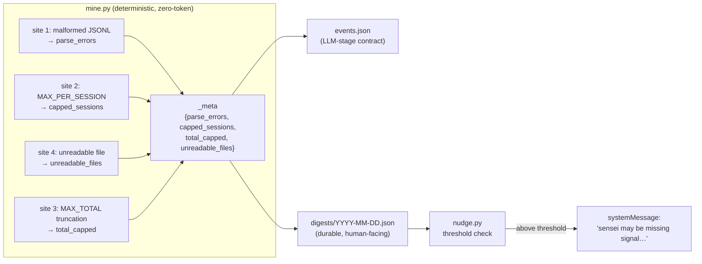

# feat: Recall Leak Counter — miner surfaces its own dropped signal

## Summary

`mine.py` discards signal in four places and reports none of it, so a degraded scan is
invisible — directly undercutting ADR-0004, which stakes the whole design on the miner favoring
*recall*. This plan makes the deterministic miner **count its own drops** at all four sites and
write them as a flat `_meta` block into both `events.json` and the dated digest JSON, then has the
SessionStart nudge surface a compact "sensei may be missing signal" warning above a noise
threshold. Zero-token, deterministic, stdlib-only — ADR-0001/0004/0008/0014 all hold.

**Scope confirmed with the user (2026-07-21):** nudge surfacing is in scope (not JSON-only);
`_meta` is flat/global (not per-project); threshold default flags rare-but-real drops immediately
and stays quiet on a couple of malformed lines.

**Product Contract preservation:** N/A — no upstream requirements doc; planned directly from
GitHub #18 (`product_contract_source: ce-plan-bootstrap`).

---

## Problem Frame

The miner drops signal silently at four sites, and its output carries no counts:

| # | Site (`mine.py`) | What is dropped | Counter |
|---|------------------|-----------------|---------|
| 1 | `mine_session` — `except Exception: continue` (the `json.loads` guard) | a malformed JSONL line | `parse_errors` |
| 2 | `mine_session` — the `friction_ok and len(events) < MAX_PER_SESSION` guard | friction events past `MAX_PER_SESSION` (15) in one session | `capped_sessions` |
| 3 | `main` — `all_events = all_events[:MAX_TOTAL]` | events past the global `MAX_TOTAL` (400) | `total_capped` |
| 4 | `mine_session` — `except OSError: return …` | an unreadable transcript file | `unreadable_files` |

A degraded scan (a project whose transcripts are half-malformed, a heavy day that blows the
per-session or global cap, a permissions problem) currently looks identical to a clean, quiet
night. The user cannot tell "nothing happened" from "sensei couldn't see." That is the exact
failure ADR-0004 exists to prevent.

**Why now:** GitHub #18 is the foundation / quick-win of the *Prove and prune* track (v-next) —
ship-first. It is independent of the #19 effectiveness-ledger keystone (worked in parallel on its
own branch); both touch `mine.py` but at non-overlapping sites (see Risks).

---

## Requirements

Traceable to GitHub #18:

- **R1** — The miner counts drops at all four sites and writes them as
  `_meta: {parse_errors, capped_sessions, total_capped, unreadable_files}` into `events.json`.
- **R2** — The same `_meta` block is carried into the dated digest JSON
  (`~/.claude/sensei/digests/YYYY-MM-DD.json`), so it survives an LLM-stage failure (ADR-0014) and
  is readable by the nudge.
- **R3** — The SessionStart nudge surfaces a compact human warning ("sensei may be missing signal…")
  derived from digest `_meta`, only above a sensible threshold to avoid noise.
- **R4** — Existing miner and digest tests are updated for the new `_meta` field; new tests cover a
  malformed line and a capped session (plus the other two sites and the nudge warning).
- **R5** — Invariants hold: stdlib-only, deterministic, zero-token; the miner stays the only reader
  of raw transcripts (ADR-0001/0004/0008).

**Out of scope** (from #18, reconfirmed): anything that *consumes* these counts beyond display; any
change to what counts as friction; per-project attribution of the counts.

---

## Key Technical Decisions

- **KTD-1 — Flat, global `_meta`, not per-project.** Matches the exact shape #18 specifies
  (`{parse_errors, capped_sessions, total_capped, unreadable_files}`). The issue's "in project X"
  phrasing becomes a single global message. Per-project attribution is a real future option but
  expands the miner's bookkeeping and the message surface; deferred (see Scope Boundaries).
- **KTD-2 — `_meta` written to *both* artifacts.** `events.json` is the miner's contract for the
  LLM stage (R1); the digest JSON is the durable, human-inspectable artifact the nudge reads (R2).
  The nudge never reads `events.json`, so the digest must carry `_meta` independently. Both dicts
  are written in `main()` from one computed `meta` object — one source, two sinks.
- **KTD-3 — `mine_session` returns a per-session `meta` dict; `main()` aggregates.** Extend the
  function's return with a 5th element `meta = {"parse_errors": int, "capped": bool, "unreadable": bool}`.
  `main()` sums `parse_errors`, counts `capped` sessions into `capped_sessions`, counts `unreadable`
  files into `unreadable_files`, and computes `total_capped` from the pre-truncation length. Keeps
  the counting local to where each drop happens rather than re-deriving it globally.
- **KTD-4 — `capped_sessions` counts *sessions*, not events.** #18 names `capped_sessions` (a
  session count) alongside the global `total_capped` (an event count). A session is "capped" if a
  qualifying friction event was dropped because `len(events)` had already reached
  `MAX_PER_SESSION`. This requires separating the *qualification* check from the *cap* check at the
  **two** `friction_ok and len(events) < MAX_PER_SESSION` guard sites in `mine_session`: the denial
  guard (`mine.py:147`) and the single shared guard (`mine.py:174`) that wraps **both** the
  `is_interrupt` and `is_correction` branches. It is a behavior-preserving restructure — the same
  events still get appended. **Subtlety:** the shared guard also sets `pending_interrupt = ev`
  (interrupt backfill, `mine.py:183`); the split must set `session_capped = True` *without* marking
  a dropped-because-full interrupt as pending, so a capped interrupt never wrongly backfills
  `followup_text` onto a dropped event.
- **KTD-5 — Nudge threshold, tunable.** Warn when `total_capped > 0` OR `capped_sessions > 0` OR
  `unreadable_files > 0` OR `parse_errors >= 10`. Rationale: cap hits and unreadable files are rare
  and each means real lost signal, so flag on first occurrence; a handful of malformed lines is
  normal transcript noise, so gate `parse_errors` behind a small floor. The threshold lives in one
  named constant/helper in `nudge.py` so it is trivially tunable after real-world use.
- **KTD-6 — Backward compatibility.** `_meta` is additive. The LLM stage clusters `events` and
  ignores unknown top-level keys. The nudge reads `digest.get("_meta")` defensively — a pre-existing
  digest without `_meta` yields no warning, never an error.
- **KTD-7 — One-line nudge constraint preserved (ADR-0015).** The nudge still emits a single
  `systemMessage`. The leak warning is appended as a compact suffix to whichever base line is shown
  (pending-proposals or heartbeat), so pending-proposal priority is untouched and the warning rides
  the same once-per-day cadence.

---

## High-Level Technical Design

Data flow — where each count originates and where it terminates:

Sites 1, 2, 4 are counted inside `mine_session` (per file/session) and aggregated in `main()`;
site 3 is measured in `main()` at the truncation point. The LLM stage consumes only `events`; the
nudge consumes only the digest.

---

## Implementation Units

### U1. Miner counts and reports its four drop sites

**Goal:** Count all four silent-drop sites and write `_meta` into both `events.json` and the dated
digest JSON.

**Requirements:** R1, R2, R4 (miner/digest tests), R5.

**Dependencies:** none.

**Files:**
- `mine.py` — modify `mine_session` and `main`.
- `tests/test_mine.py` — update `TestMineDigest`; add `_meta` coverage.
- `skill/SKILL.md` — one-line note in the `events.json` contract (lines ~26-30) that the output also
  carries a `_meta` drop-count block the LLM stage ignores. Keeps the documented contract honest.

**Approach:**
- In `mine_session`: increment a local `parse_errors` on the `json.loads` `except`. Separate the
  qualification check from the cap check at the two guard sites (denial `mine.py:147`; the shared
  interrupt+correction guard `mine.py:174`) so a qualifying-but-dropped event sets
  `session_capped = True` without changing which events are appended, and without marking a
  dropped interrupt as `pending_interrupt` (KTD-4). On the `except OSError` early return, return
  `unreadable=True`. Return
  a 5th element `meta = {"parse_errors", "capped", "unreadable"}` (KTD-3). The unreadable early-return
  must return a full, well-formed tuple (empty events, windows False, empty phrases, meta with
  `unreadable=True`).
- In `main`: aggregate `parse_errors` (sum), `capped_sessions` (count of `capped`), `unreadable_files`
  (count of `unreadable`) across all sessions. Compute `total_capped = max(0, len(all_events) - MAX_TOTAL)`
  **before** `all_events = all_events[:MAX_TOTAL]`. Build one `meta` dict and add it as `_meta` to both
  the `out` dict and the `digest` dict (KTD-2).

**Patterns to follow:** existing `mine_session` return-tuple + `main` aggregation style
(`sessions_scanned`, `repeat_sessions_total`); existing digest dict construction; underscore-prefixed
key to mark non-event metadata.

**Execution note:** Behavior-preserving restructure of the friction-append blocks — add a
characterization check first (assert existing fixture event counts are unchanged) before separating
the cap check, then add the new counters.

**Test scenarios** (`tests/test_mine.py`):
- Malformed line: a session with one valid friction record and one non-JSON line → `_meta.parse_errors == 1`, valid event still emitted. *(covers #18 "a malformed line")*
- Capped session: a session with > `MAX_PER_SESSION` qualifying friction events → `_meta.capped_sessions == 1` and emitted friction events for that session `== MAX_PER_SESSION` (behavior unchanged). *(covers #18 "a capped session")*
- Capped interrupt does not leak backfill: a session where the event that would exceed `MAX_PER_SESSION` is an `interrupt` followed by plain text → the dropped interrupt is not appended and its would-be `followup_text` is not backfilled onto any earlier event (guards the KTD-4 `pending_interrupt` subtlety).
- Unreadable file: call `mine_session` (or run the miner) against a path that raises `OSError` — pass a **directory** path so `open()` raises `IsADirectoryError` (an `OSError` subclass), portable and root-safe → `_meta.unreadable_files == 1`, no events.
- Global truncation: generate > `MAX_TOTAL` friction events across sessions → `_meta.total_capped == (produced - MAX_TOTAL)` and `len(events) == MAX_TOTAL`.
- `events.json` `_meta` present: fixtures run → `data["_meta"]` has all four keys, all zero for the clean fixtures.
- Digest `_meta` present and equal: the digest JSON's `_meta` equals `events.json`'s `_meta`.
- Update `TestMineDigest.test_digest_fields_and_counts` / `test_digest_zero_events` if adding `_meta` to the asserted field set; existing `by_type`/`by_project` sum assertions must still pass.

**Verification:** `python3 -m unittest discover tests` passes; a manual
`python3 mine.py --days 7 --out <scratch>` writes an `events.json` and digest each containing a
four-key `_meta` block. (Never point `--out` at live `~/.claude/sensei/events.json`.)

---

### U2. Nudge surfaces the leak warning above a threshold

**Goal:** Render a compact "sensei may be missing signal" warning from digest `_meta` when it
crosses the threshold, without disturbing the existing one-line / pending-proposal behavior.

**Requirements:** R3, R4 (nudge tests), R5, plus KTD-5/6/7.

**Dependencies:** U1 (digest must carry `_meta`).

**Files:**
- `nudge.py` — add a threshold helper and append the warning to the emitted line.
- `tests/test_nudge.py` — extend `write_digest` to accept `meta`; add warning tests.

**Approach:**
- Add a helper `leak_warning(meta) -> str | None` that returns a compact summary string when the
  threshold (KTD-5) is crossed, else `None`. Read `meta = digest.get("_meta") or {}` defensively
  (KTD-6). In `run`, after the base `line` is chosen (pending or heartbeat) and before `emit`, append
  the warning suffix when present (KTD-7), e.g. `f"{line} | sensei may be missing signal: {warning}"`.
  Keep the whole thing one `systemMessage` line. Optionally also fold the detail into
  `additionalContext` via the existing `emit(..., additional_context=...)` path.
- Do not change the `digest is None` early-return (nightly-didn't-run path) — no digest means no
  `_meta` to report.

**Patterns to follow:** existing `run` line-construction and `emit` signature; the defensive
`digest.get(...)` style already used for `sessions_scanned` / `events_total`.

**Test scenarios** (`tests/test_nudge.py`):
- Over threshold, heartbeat base: digest with `_meta` (e.g. `total_capped=5`), no pending proposals →
  `systemMessage` contains both the heartbeat text and "missing signal".
- Over threshold, pending base: digest with over-threshold `_meta` + a pending proposal → message
  contains the pending-proposals text **and** the warning (priority preserved, warning appended).
- Under threshold: `_meta` with only `parse_errors=3` (below the floor of 10), zeros elsewhere →
  no "missing signal" text.
- Backward compat: digest with **no** `_meta` key → no warning, no error, normal heartbeat.
- Extend `write_digest(..., meta=None)` so tests can inject `_meta`; existing nudge tests keep
  passing unchanged (default `meta=None` → key absent).

**Verification:** `python3 -m unittest discover tests` passes; a manual nudge run against a scratch
sensei-dir with an over-threshold digest prints a single `systemMessage` line carrying the warning.

---

## Scope Boundaries

**In scope:** the four counters, `_meta` in both artifacts, the thresholded nudge warning, and the
tests above.

### Deferred to Follow-Up Work
- **Per-project attribution** of the drop counts (the literal "in project X" message). Real value,
  but expands miner bookkeeping and the message surface beyond #18's flat `_meta` shape.
- **Threshold tuning** from real-world digests once the counters have run for a while (KTD-5 defaults
  are a first guess).

### Outside this product's identity
- Anything that **consumes** the counts beyond display (e.g., auto-suppressing a noisy project,
  retrying unreadable files) — out per #18 and the *Prove and prune* scope firewall.
- Any change to **what counts as friction** — out per #18.

---

## Risks & Dependencies

- **Parallel edits to `mine.py` with #19 (effectiveness ledger).** Both branches touch `mine.py`.
  #18's sites are the parse/cap/truncation/read guards and the two output dicts in `main`; #19
  recomputes accepted-rule rates (a decisions.jsonl × events.json join). The likely overlap is the
  `main()` output-dict region. *Mitigation:* isolated worktrees + independent merges to `main`; keep
  U1's `main()` change to the additive `_meta` line and the pre-truncation measurement; resolve any
  conflict at merge, not by coordinating branches.
- **`capped_sessions` restructure risk.** Separating qualification from the cap check touches the
  hottest part of `mine_session`. *Mitigation:* the characterization check in U1's execution note —
  assert the existing fixtures' event counts are byte-for-byte unchanged before/after.
- **Nothing runs from the repo (ADR-0009).** Edits are inert until `./install.sh` re-runs. Test the
  miner straight from the repo against fixtures / a scratch `--out`; never overwrite live
  `~/.claude/sensei/events.json`. Do not touch live `~/.claude/sensei/` state during development.

---

## Definition of Done

- Miner counts all four drop sites and writes a four-key `_meta` block into `events.json` **and** the
  dated digest JSON (R1, R2).
- The nudge surfaces a compact "missing signal" warning above the threshold and stays silent below it,
  preserving the single-line / pending-proposal behavior (R3).
- `python3 -m unittest discover tests` passes, including new tests for a malformed line and a capped
  session (and the other two sites + the nudge warning) (R4).
- Invariants intact: stdlib-only, deterministic, zero-token; miner remains the sole raw-transcript
  reader (R5); `skill/SKILL.md`'s `events.json` contract note mentions `_meta`.

---

## Verification Contract

- `python3 -m unittest discover tests` — all green.
- Manual miner smoke: `python3 mine.py --days 7 --out /private/tmp/.../events.json` → both the
  `events.json` and the sibling `digests/<date>.json` contain a four-key `_meta` block.
- Manual nudge smoke: run `nudge.py --sensei-dir <scratch> --now <iso>` against a scratch dir holding
  an over-threshold digest → one `systemMessage` line carrying the warning; repeat with a below-threshold
  and a no-`_meta` digest → no warning.

---

## Sources & Research

- GitHub #18 (origin), milestone *v-next: Prove it works*.
- `docs/ideation/2026-07-21-sensei-next-focus-ideation.html` (idea #6), via #18.
- ADR-0001 (deterministic miner), ADR-0004 (miner favors recall), ADR-0008 (stdlib-only),
  ADR-0014 (digest is a deterministic miner artifact), ADR-0015 (in-session nudge is the sole
  announcement surface).
- `STRATEGY.md` — *Prove and prune* track; this is its ship-first foundation quick-win.
- Code read: `mine.py`, `nudge.py`, `tests/test_mine.py`, `tests/test_nudge.py`, `skill/SKILL.md`.
- No external research — internal change, strong local patterns.
