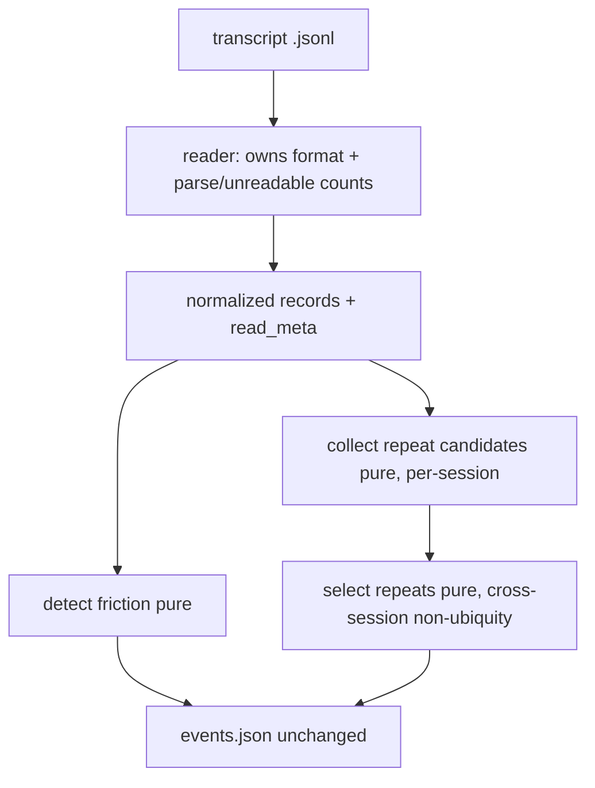

# Miner Reader/Detector Seam - Plan

## Goal Capsule

- **Objective:** Split the Miner internally into one transcript **reader** and pure **detectors**, so detection policy has its own interface seam and is testable without a subprocess or on-disk fixture.
- **Product authority:** The solo developer maintaining sensei (STRATEGY.md primary persona). This is sanctioned boy-scout cleanup inside the current milestone, not a new track.
- **Open blockers:** None. Investigated under issue #23; approach validated by a throwaway spike.

---

## Product Contract

### Summary

Introduce an internal reader/detector seam in `mine.py`. One reader owns the Claude Code transcript format and yields normalized records; pure detector functions turn those records into events. The Miner stays the single deterministic transcript reader and its external interface is unchanged — the depth is entirely internal.

### Problem Frame

`mine_session` interleaves two things that vary for unrelated reasons: knowledge of the external transcript format (JSONL parse, record-type dispatch, `tool_use`/`tool_result` correlation, the `[Request interrupted by user` sentinel, string-or-array content), and detection policy (correction lexicon, interrupt/denial/repeat rules, followup backfill). The format is fixed by Claude Code; the policy is ours and evolves.

Because the two are fused, the only test surface is `tests/test_mine.py` shelling out via `subprocess.run` over JSONL fixtures written to a temp projects dir — testing a one-line lexicon change means authoring a whole transcript on disk. Repeat detection is smeared across two places (`mine_session` collects candidate phrases; `main` runs the cross-session non-ubiquity test). And the function's return has grown to a five-tuple `(events, in_friction_window, in_repeat_window, repeat_phrases, meta)` — evidence the single function keeps accreting responsibilities (the `meta` dict arrived with the Recall Leak Counter, #18).

### Key Decisions

- **Adopt the seam.** Two things genuinely vary independently (fixed external format, evolving detection policy), so the seam is real rather than speculative abstraction. Depth is a property of the interface, not the implementation.
- **The reader owns format knowledge and format-level drop counts.** Parsing, block flattening, `tool_use` extraction, `isSidechain`/`isMeta` skipping, and the `parse_errors`/`unreadable` counts (#18) all belong to the reader — they are facts about reading the file, not about detecting friction.
- **Detectors are pure functions over normalized records.** No I/O; callable against an in-memory record list. The `capped` signal (a qualifying friction event dropped at `MAX_PER_SESSION`) is a detection statistic and rides with the friction detector, not the reader.
- **Repeat detection becomes local.** Two named functions replace the smear: per-session candidate collection, and the cross-session non-ubiquity selection (ADR-0011).
- **Normalized record shape.** Detectors need, per message in order: the raw timestamp (for output) and a parsed timestamp (for window filtering); a role (assistant / user / other); flattened text; the message's `tool_use`s (id, name, input) and `tool_result`s (tool-use id, result text). `other` records carry only timestamps so window membership stays a property of the record stream. Exact representation is a planning/implementation choice.

### Requirements

**Seam structure**

- R1. `mine.py` exposes one reader that owns all transcript-format knowledge and yields normalized records plus the format-level drop counts (`parse_errors`, `unreadable`).
- R2. Friction detection (denial, interrupt, correction, followup backfill) is a pure function over normalized records; it also reports whether the session was capped at `MAX_PER_SESSION`.
- R3. Repeat detection is split into a pure per-session candidate collector and a pure cross-session non-ubiquity selector.
- R4. The five-tuple return of `mine_session` is dissolved: window membership is derived from the record stream, and the per-stage statistics travel with the stage that produces them.

**Behavior preservation**

- R5. The external interface is unchanged: `mine.py --days N --out PATH` → `events.json`, plus the `--projects-dir` flag and the digest artifact.
- R6. `events.json` content is byte-for-byte identical to the pre-refactor output for the same input (excluding the inherently non-deterministic `generated_at` timestamp), including the `_meta` block.
- R7. The Miner remains deterministic, zero-token, stdlib-only, and the single component that reads raw transcripts.

**Testability**

- R8. At least one detector is unit-tested against an in-memory list of normalized records — no subprocess, no temp dir, no on-disk fixture.
- R9. The existing subprocess/fixture tests continue to pass unchanged, serving as the integration guard over the seam.

**Consistency**

- R10. The change preserves ADR-0001 (deterministic miner is the only transcript reader), ADR-0004 (favors recall; the repeat structural-thinning exception in ADR-0011 stays scoped to repeats), and ADR-0008 (stdlib-only).

### Acceptance Examples

- AE1. **Covers R6, R9.** Running the miner over `tests/fixtures/projects` before and after the refactor yields identical `events`, `_meta`, `sessions_scanned`, and `days`; the full existing test suite passes.
- AE2. **Covers R8.** A test constructs a short list of records (e.g. an assistant message, a user interrupt, a plain follow-up) and calls the friction detector directly, asserting the emitted event without touching the filesystem.

### Scope Boundaries

- Detection policy does not change: no new event types, no lexicon edits, no recall/precision tuning. This is a structural move only.
- The external CLI, `events.json` schema, and digest output do not change.
- No cross-run state, ledger, or persistence is introduced (ADR-0010 stands).

### Dependencies / Assumptions

- Stdlib-only; no new dependencies (ADR-0008).
- Transcripts are appended in chronological order. The seam relies on this only at one micro-edge (interrupt-followup backfill across the repeat-but-not-friction window), which is unreachable under chronological ordering because the repeat window contains the friction window; output is unaffected.

### Outstanding Questions

**Deferred to Planning**

- Whether to record the seam in a short ADR (as the testing interface, so a future change does not re-fuse format and policy). Leaning yes; no invariant changes, so it is documentation rather than a new decision.
- Exact representation of the normalized record (namedtuple vs dataclass vs dict) and precise function names/signatures.

### Sources / Research

- Investigation and validated spike: issue #23 (recommendation comment records the seam, the dissolved tuple, and byte-for-byte confirmation). The spike code itself was discarded; implementation proceeds fresh here.
- Current implementation: `mine.py` (`mine_session`, `main`), tests in `tests/test_mine.py`.
- Governing ADRs: `docs/adr/0001-deterministic-miner-llm-only-sees-events.md`, `docs/adr/0004-miner-favors-recall-precision-is-the-llms-job.md`, `docs/adr/0008-stdlib-only-no-dependencies.md`, `docs/adr/0010-miner-stateless-wide-window-over-ledger.md`, `docs/adr/0011-repeat-events-structural-thinning.md`.
